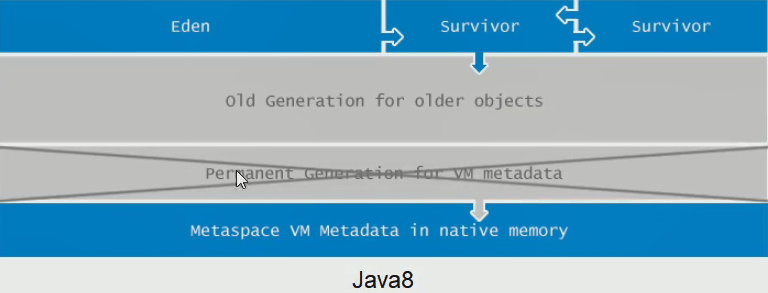
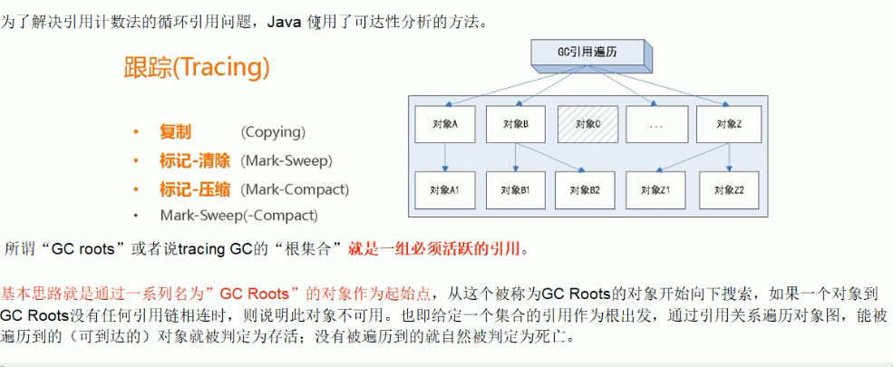
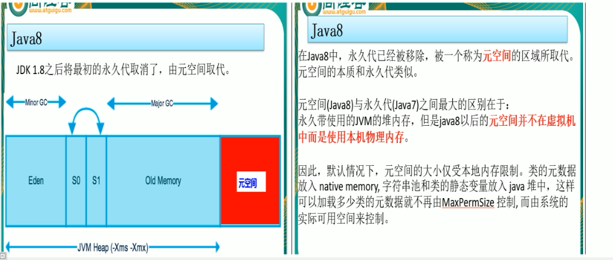
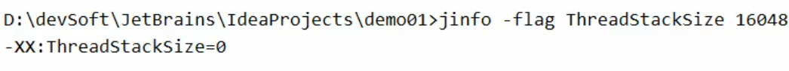
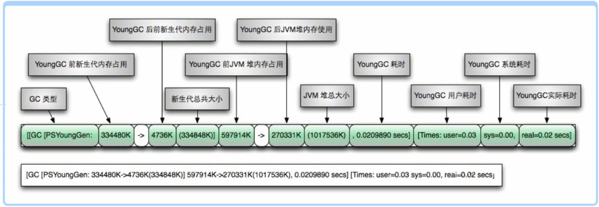

[TOC]

# JVM与GC解析

## Jvm内存结构




## 面试题

### 谈谈你对GC-Roots的理解




**以下对象可以成为GC-Roots对象**

1、虚拟机栈(栈帧中的局部变量表)中的引用的对象  
2、方法区中的类静态属性引用的对象  
3、方法区中常量引用的对象  
4、本地方法栈中JNI(Native方法)引用的对象  

## JVM参数相关
### 三种参数类型
#### 标配参数
在jdk各个版本之间稳定，很少有大的变化，例如：  
`-version, -help` 等

#### X参数

`-Xint`：解释执行  

`-Xcomp`：第一次使用就编译成本地代码  

`-Xmixed`：混合模式  

`-Xms`

`-Xmx`

#### XX参数

> 查看运行汇总的java程序，它的某个Jvm参数是否开启，具体值是多少？
>
> 使用jinfo
> 第一种，使用`jinfo -flag 具体参数 java进程编号`
> 例如 `jinfo -flag PrintGCDetails 13632`
>
> 第二种，使用 java -XX:+PrintFlagsInitial  打印初始值
> ```shell
> C:>java -XX:+PrintFlagsInitial
> [Global flags]
> uintx AdaptiveSizeDecrementScaleFactor          = 4    {product}
> uintx AdaptiveSizeMajorGCDecayTimeScale         = 10   {product}
> uintx AdaptiveSizePausePolicy                   = 0    {product}
> uintx AdaptiveSizePolicyCollectionCostMargin    = 50   {product}
> uintx AdaptiveSizePolicyInitializingSteps       = 20   {product}
> uintx AdaptiveSizePolicyOutputInterval          = 0    {product}
> uintx AdaptiveSizePolicyWeight                  = 10   {product}
> uintx AdaptiveSizeThroughPutPolicy              = 0    {product}
> bool UseLargePagesIndividualAllocation        := false {pd product}
> bool AdjustConcurrency                         = false {product}
> bool AggressiveOpts                            = false {product}
> intx AliasLevel                                = 3     {C2 product}
> bool AlignVector                               = true  {C2 product}
> ....more
> ```
> 可以看见，有些值的等号前面没有冒号，有些值有冒号。在这里，冒号的意思是这个值在JVM加载的时候JVM自己修改或者被人为的修改过
>
> java -XX:PrintFlagsFinal -Xss128k [运行类名]  可以打印运行时的值信息，(首次启动时)
>
> java -XX:PrintCommandLineFlags -version 查看运行时的命令行 (首次启动时)，主要可以用来查看**目前使用的垃圾回收器**
>
> ```shell
> C:\Users\XiongCheng>java -XX:+PrintCommandLineFlags -version
> -XX:InitialHeapSize=267158464 -XX:MaxHeapSize=4274535424 -XX:+PrintCommandLineFlags -XX:+UseCompressedClassPointers -XX:+UseCompressedOops -XX:-UseLargePagesIndividualAllocation -XX:+UseParallelGC
> java version "1.8.0_181"
> Java(TM) SE Runtime Environment (build 1.8.0_181-b13)
> Java HotSpot(TM) 64-Bit Server VM (build 25.181-b13, mixed mode)
> ```
>
> 

1. Boolean类型：  
   -XX:+或者-某个属性值 (+ 表示开始，- 表示关闭)  

2. KV设值类型：  
   -XX:属性key=属性值value  

**踩坑点**
问：-Xms和-Xmx是属于哪种参数类型  
其实：  
-Xms 等价于 -XX:InitialHeapSize  
-Xmx 等价于 -XX:MaxHeapSize  
所以，Xms和Xmx就相当于那两个参数的别名，因此，这两个参数是属于XX参数。  
同理-Xss 等价于 -XX:ThreadStackSize

### JVM内存相关



用代码获取jvm中的内存相关信息

```java
long totalMemory = Runtime.getRuntime().totalMemory();
long maxMemory = Runtime.getRuntime().maxMemory();
```

如果JVM在启动的时候没有指定**Xms**大小，则默认是系统总内存的**64分之一**  
如果JVM在启动的时候没有指定**Xmx**大小，则默认是系统总内存的**4分之一**   
#### -Xss 设置线程栈大小
当没有设置栈大小的时候，使用`jinfo -flag ThreadStackSize [pid] `会发现显示的是0值  
  
在这里，0就代表了使用默认值，在不同的平台，有可能有着不同的默认值  


java官方文档地址：https://docs.oracle.com/en/java/javase/11/tools/java.html  

#### -Xmn 设置年轻代大小


#### -XX:MetaspaceSize 设置元空间大小
元空间的本质和永久代相似，都是对JVM规范中的方法区的实现。不过元空间与永久代之间最大的区别在于：**元空间不在虚拟机中，而是使用本地内存**。  
因此，默认情况下，元空间大小仅仅受本地内存限制。  

#### -XX:PrintGCDetails 打印GC信息


GC信息解读  



FGC信息解读  

  
  
#### -XX:SurvivorRatio 调整新生代(Eden)与幸存区(survivor)空间大小比例
默认值是8  

#### -XX:NewRatio 配置年轻代与老年代在堆结构中的占比
默认是2  
-XX:NewRatio=2 新生代占1，老年代占2，年轻代占整个堆的1/3  
-XX:NewRatio=4 新生代占1，老年代占4，年轻代占整个堆的1/5  
NewRatio值就是设置老年代的占比，剩下的1给新生代  
#### -XX:MaxTenuringThreshold 最大晋升年龄
-XX:MaxTenuringThreshold = 15表示，一个对象，从新生代到老年代，要经过15次垃圾回收，才能晋升到老年代  
如果设置为0的话，年轻代在第一次GC之后是不会经过Survivor区，直接进入老年代。对于老年代比较多的应用，可以提高效率。如果将此值设置为一个较大值，则年轻代对象会在survivor区进行多次复制，这样可以增加对象在年轻代的存活时间，增加在年轻代被回收的概率。  
### JVM的两种模式
当使用的是32位的Windows操作系统，不论硬件如何都默认使用Client的JVM模式  
32位其他操作系统，2G内存同时有2个cpu以上用Server模式，低于该配置还是Client模式  
64位，只有server模式

## 强软弱虚四种引用

  


### Reference 强引用
`Book bk = new Book()`  
当内存不足时，JVM开始垃圾回收，对于强引用的对象，**就算是出现了OOM也不会对该对象进行回收，死都不收**  
强引用是我们最常见的引用，只要还有强引用指向一个对象，就能表明对象还“活着”，垃圾收集器不会碰这种对象。在Java中最常见的就是强引用，把一个对象赋给一个引用变量，这个引用变量就是一个强引用。当一个对象被强引用变量引用时，它处于可达状态，它是不可能被垃圾回收机制回收的，**即使该对象以后永远都不会被用到，JVM也不会回收**。因此强引用是造成Java内存泄漏的主要原因之一。  
对于一个普通对象，如果没有其他的引用关系，只要超过了引用的作用域或者显式地将相应(强)引用赋值为null，一般认为就是可以被垃圾收集的了(当然具体回收时机还是要看垃圾收集策略)
### SoftReference 软引用
软引用时一种相对强引用弱化了一些的引用，需要用java.lang.ref.SoftReference类来实现，可以让对象豁免一些垃圾回收。 
对于只有软引用的对象来说:  
当系统内存**充足**时它**不会**回收  
当系统内存**不足**时它**会**被回收  

> 软引用通常用在对内存敏感的程序中，比如高速缓存就有用到软引用，内存够用的时候就保留，不够用就回收！
>
> mybatis 缓存相关有用到

### WeakReference 弱引用
弱引用需要用java.lang.ref.WeakReference类来实现，它比软引用的生存期更短  
对于只有弱引用的对象来说，只要垃圾回收机制一运行，不管JVM的内存空间是否足够，都会回收该对象占用的内存  

**使用场景**：  
假如有一个应用需要读取大量的本地图片，可以用一个HashMap来保存图片的路径和相应图片对象关联的软引用之间的映射关系，在内存不足时，JVM会自动回收这些缓存图片对象所占用的空间，从而有效的避免OOM的问题  
设计缓存的时候，也可以按照这样来设置，当内存不足时，从缓存map中回收一些软引用的对象来保持内存不会撑爆  

> WeakHashMap： 当GC发生时，map中的key在外部没有强引用的时候，key会被回收

### PhantomReference 虚引用
虚引用不会决定对象的生命周期  
如果一个对象仅持有虚引用，那么它就和没有任何引用一样，在任何时候都可能被垃圾回收器回收，它不能单独使用也不能通过它访问对象，虚引用必须和引用队列(ReferenceQueue)联合使用。  

虚引用的主要作用是跟踪对象被垃圾回收的状态。仅仅是提供了一种确保对象被finalize以后，做某些事情的机制。  

PhantomReference的get方法总是返回null，因此无法访问对应的引用对象。其意义在于说明一个对象已经进入finalization阶段，可以被gc回收，用来实现比finalization机制更灵活的回收操作。  

设置虚引用关联的唯一目的，就是在这个对象被收集器回收的时候收到一个系统通知或者后续添加进一步的处理。Java技术允许使用finalize()方法在垃圾收集器将对象从内存清除出去之前做必要的清理工作。  
### ReferenceQueue 引用队列
ReferenceQueue 是用来配合引用工作的，没有ReferenceQueue一样可以运行  

创建引用的时候可以指定关联的队列，当GC释放对象内存的时候会将引用加入到引用队列，如果程序发现某个虚引用已经被加入到了引用队列，那么就可以在所引用的对象的内存被回收之前采取必要的行动，这相当于是一种通知机制  
当关联的引用队列中有数据的时候，意味着引用指向的堆内存中的对象被回收。通过这种方式，JVM允许我们在对象被销毁后，做一些自定义的事情  
`ReferenceQueue<Object> queue = new ReferenceQueue<>();`

# OutOfMemoryError

  

在说这些问题的时候，要注意什么是异常，什么是错误，不能混淆和乱说。

## StackOverflowError

一般出现在递归调用的过程中把调用栈打爆了

## Java heap space

堆内存不足，很常见的异常

## GC overhead limit exceeded


GC任务繁重，gc使用的时间占比超过了限制阈值  

GC回收时间过长时会抛出OOM。过长的定义是，超过98%的时间用来做GC并且回收了不到2%的堆内存，连续多次GC都只回收了不到2%的极端情况下才会抛出。  
假如不抛出 GC overhead limit exceeded 错误会发生什么情况呢，那就是GC清理的这么点内存很快会再次填满，迫使HC再次执行，就形成了恶心循环，CPU占用率一直是100%，而GC却没有任何成果

## Direct buffer memory
写NIO程序经常使用ByteBuffer来读取或者写入数据，这是一种基于通道(channel)与缓冲区(buffer)的I/O方式。它可以使用native函数库直接分配堆外内存，然后通过一个存储在Java堆里面的DirectByteBuffer对象作为这块内存的引用进行操作。这样能在一些场景中显著提高性能，因为避免了在Java堆和Native堆中来回复制数据。  
`ByteBuffer.allocate(capability)` 第一种方式是分配JVM堆内存，属于GC管辖范围，由于需要拷贝，所以速度相对较慢  
`ByteBuffer.allocateDirect(capability)` 第二种方式是分配OS本地内存，不属于GC管辖范围，由于不需要内存拷贝，所以速度相对较快。  
但如果不断分配本地内存，堆内存很少使用，那么JVM就不需要执行GC，DirectByteBuffer对象们就不会被回收，这时候堆内存充足，但本地内存可能已经使用光了，再次尝试分配本地内存就会出现OutOfMemoryError

> 一般默认JVM可以使用的本地内存为最大物理内存的1/4

## Unable to create new native thread 

首先考虑是不是内存不足，可能由于堆设置过大，导致线程可使用的内存过少，因为线程创建是要为其分配PC计数器，虚拟机栈，本地方法栈的，在不增大内存的情况下，可以减小堆大小和栈大小来创建更多的线程。但是通过现场的jmap -heap [pid] 查看内存占用其实并不多，用jstack统计线程数，有近500，大部分是来自tomcat线程池与hbase线程。所以考虑是不是hbase抖动。
由于hbase端出现抖动，导致线程池线程数量拉高，这个现象也会在hbase线程池体现，因为一个请求会由一个tomcat线程来处理，同时也对应着一个hbase线程池的线程，当线程池的达到了最大核心线程的数量，同时阻塞队列满的时候，就会继续开启新的线程来进行处理，直到达到了线程池最大线程数的限制，spring-boot自带的tomcat默认线程池最大线程数是200，所以最坏情况下会同时处理200个请求，其他的进入等待队列，200个请求也会同样对应hbase连接池的200个处理线程，这里保守就有400个线程。又由于当时服务器设置的max user processes只有1024，同时，服务器上还部署着一些其他java服务，所以高峰时刻，冲过了1024，达到了max user processes的限制。系统拒绝了线程的创建，导致了这个问题出现。由于不能随意重启线上服务，所以我通过修改/proc/{pid}/limits中的Max processes 对应的soft limits，使得服务能继续创建线程，暂时维持了服务稳定，，同时其他服务也一并修改，但是后续评估发现，max user processes也的确设置的过小了，就将这个值修改为了10240，并择机将机器上服务全部滚动重启，使参数生效。

对于这个问题，可以通过改大max user processes参数，也可以降低tomcat 线程池大小，或者控制hbase线程池大小来缓解这个问题

## Metaspace
Java8及以后的版本使用Metaspace来替代永久代。  
Metaspace是方法区在HotSpot中的实现，它与永久代最大的区别在于: Metaspace并不在虚拟机内存中而是使用的本地内存，也就是说在Java8 类的元数据信息被存储在叫做Metaspace的native memory当中  
永久代(Java8后被元空间取代了) 存放了以下信息：
1.已被虚拟机加载的类信息
2.运行时常量池
3.字符串常量池(JDK7从永久代移出)
4.静态变量(JDK7 从永久代移出)
5.即时编译后的代码  
> The Java Virtual Machine has a method area that is shared among all Java Virtual Machine threads. The method area is analogous to the storage area for compiled code of a conventional language or analogous to the "text" segment in an operating system process. It stores per-class structures such as the **run-time constant pool**, **field** and **method data**, and **the code for methods** and **constructors**, including the special methods (§2.9) used in class and instance initialization and interface initialization
>
> 引用自：《Java虚拟机规范》https://docs.oracle.com/javase/specs/jvms/se8/html/jvms-2.html#jvms-2.5.4


所以，模拟Metaspace溢出。只要不断生成新的类往Metaspace中写即可。  动态生成类可以使用CGLIB 的字节码技术

# GC相关

GC算法(复制算法/标记清除/标记整理/分代算法)是内存回收的方法论，垃圾收集器就是算法的落地实现  

> 天上飞的理念，需要有落地的实现 ^_^


串行(serial)，并行(parallel)，并发(concurrent)，G1  

串行：垃圾回收前，先停止用户线程(STW:stop the world)，然后只有一个垃圾收集线程工作，由于垃圾收集的时候会**暂停**用户**所有**线程，不适合服务器环境  
并行：垃圾回收前，先停止用户线程，然后有多个垃圾收集线程工作，适用于科学计算/大数据处理等弱交互场景  
并发：垃圾回收时，用户线程和垃圾收集线程同时执行(不一定是并行，可能是交替执行)，不需要停顿用户线程，适用于对响应时间有要求的场景  
G1: G1垃圾回收器将堆内存分隔成不同的区域然后并发的对其进行垃圾回收


查看默认的垃圾回收器，使用-XX:+PrintCommandLineFlags 可以打印出正在使用的参数项
```shell
F:\IdeaProject\RookieRoad>java -XX:+PrintCommandLineFlags -version
-XX:InitialHeapSize=132499904 -XX:MaxHeapSize=2119998464 -XX:+PrintCommandLineFlags -XX:+UseCompressedClassPointe
rs -XX:+UseCompressedOops -XX:-UseLargePagesIndividualAllocation -XX:+UseParallelGC
java version "1.8.0_71"
Java(TM) SE Runtime Environment (build 1.8.0_71-b15)
Java HotSpot(TM) 64-Bit Server VM (build 25.71-b15, mixed mode)
```
可以看到，jdk8默认使用的是`ParallelGC`  
对于运行中的服务，可以使用jinfo进行查看`jinfo -flag UseParallelGC [pid]`
## GC算法


## 垃圾回收器


上面函数式JVM验证GC配置的合理性。同时也可以看出，有如代码所示的几种垃圾回收器  
UseSerialGC  
UserParallelGC (parallel scavenge)  
UseParallelOldGC  
UseConcMarkSweepGC  
UseParNewGC  
UseG1GC

  


打了叉的表示连线的两个是**不能**组合使用的  
### 串行收集器 SerialGC
一个单线程的收集器，在进行垃圾收集的售后必须暂停其他所有工作线程直到它收集结束。  


串行收集器是最古老，最稳定以及效率高德收集器，只使用一个线程去回收，但其在进行垃圾收集的过程中可能会产生较长的停顿(STW).虽然在收集垃圾过程中需要暂停所有其他的工作线程，但是它简单高效，对于限定单个CPU环境来说，没有线程交互的开销可以获得最高的单线程垃圾收集效率，因此Serial垃圾收集器依然是Java虚拟机运行在Client模式下默认的新生代垃圾收集器。  

在开启后，会使用SerialGC(Young区使用) + Serial Old(Old区用)的收集器组合  
在新生代与老年代都会使用串行垃圾回收器，新生代使用复制算法，老年代使用标记-整理算法