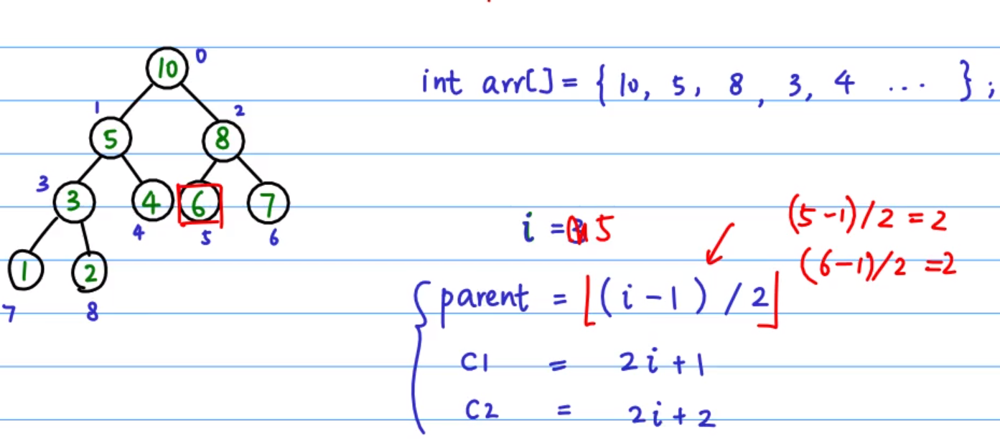
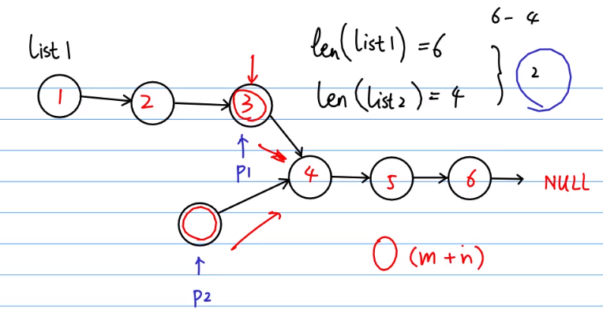
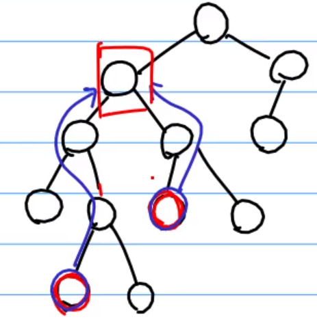

# 排序算法

## 堆排序O(nlogn)

  

将数组看作是堆中元素从左往右编号后得到的数据，就能通过数组下标来访问整个堆，而不用真正构建堆  
由堆特性可以知道：  
i(下标)节点的父节点下标为`Math.floor((i - 1) / 2)`  
左节点下标为`2 * i + 1`  
右节点下标为`2 * i + 2`  

对于一个完全乱序的堆，要从层高(h)的h-1层开始的最后一个有子节点的节点开始，倒着走，对每一个节点依次做heapify。如下图所示：  

  

h-1层开始的最后一个有子节点的节点其实就是整个堆最后一个节点的父节点。

https://www.bilibili.com/video/av47196993

# 两个链表求交点

可以先判断两条链表的长度，然后让更长的链表的指针先走过长度差值个节点，使得两条链的剩余的长度相等，这样，两条链的指针再一起移动，判断指向的是不是同一个节点就可以了

https://www.bilibili.com/video/av39115738

扩展：链表求交点的变种也可以是，在二叉树当中，求两个节点间的最短路径，只要寻找到公共祖先，就能求的结果。如图所示：  

