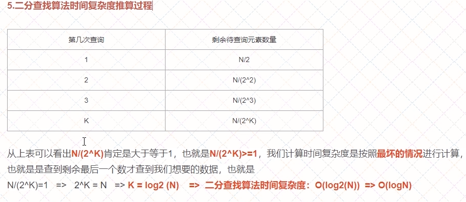
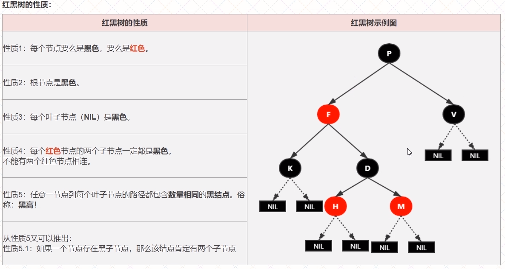
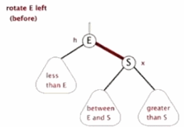
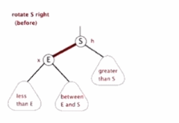
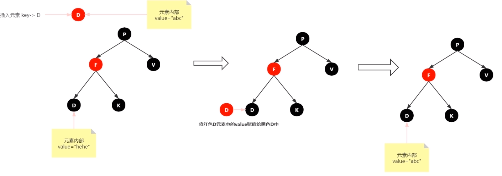
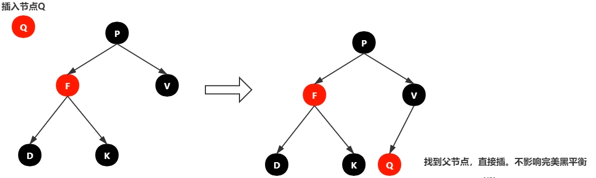
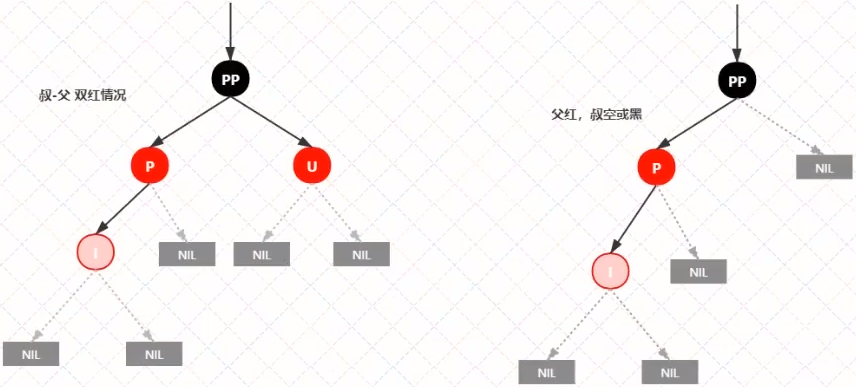
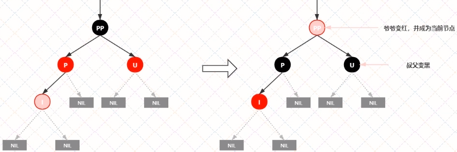

# 排序算法

## 堆排序O(nlogn)

  

将数组看作是堆中元素从左往右编号后得到的数据，就能通过数组下标来访问整个堆，而不用真正构建堆  
由堆特性可以知道：  
i (下标)节点的父节点下标为`Math.floor((i - 1) / 2)`  
左节点下标为`2 * i + 1`  
右节点下标为`2 * i + 2`  

对于一个完全乱序的堆，要从层高(h)的h-1层开始的最后一个有子节点的节点开始，倒着走，对每一个节点依次做heapify。如下图所示：  

  

h-1层开始的最后一个有子节点的节点其实就是整个堆最后一个节点的父节点。

https://www.bilibili.com/video/av47196993

# 两个链表求交点

可以先判断两条链表的长度，然后让更长的链表的指针先走过长度差值个节点，使得两条链的剩余的长度相等，这样，两条链的指针再一起移动，判断指向的是不是同一个节点就可以了

https://www.bilibili.com/video/av39115738

扩展：链表求交点的变种也可以是，在二叉树当中，求两个节点间的最短路径，只要寻找到公共祖先，就能求的结果。如图所示：  

# 二分查找

# 红黑树

红黑树能自平衡，靠的是三种操作：变色，左旋，右旋

1、变色：节点的颜色由红边黑或者由黑变红  

2、左旋：以某个节点作为支点(旋转节点)，其右子节点变为旋转节点的父节点，右子节点的左子节点变为旋转节点的右子节点，左子节点保持不变。  

  

3、右旋：以某个节点作为支点(旋转节点)，其左子节点变为旋转节点的父节点，左子节点的右子节点变为旋转节点的左子节点，右子节点保持不变。  

  

## 插入

插入节点，必须为红色，理由很简单，红色在父节点(如果存在)为黑色节点时，红黑树的黑色平衡没被破坏，不需要做自平衡操作。  

但如果插入节点时黑色，那么插入位置所在的子树黑色节点总是多1(违反性质5)，必须做自平衡。  

插入有如下情形：

**情景1：红黑树为空树**  

这是最简单的一种情景，直接把插入节点作为根节点就行  

注意：根据红黑树性质2，根节点是黑色，还需要把插入节点设置为黑色  

**情景2：插入节点的Key存在**  

  

处理：更新当前节点的值为插入节点的值  

**情景3： 插入节点的父节点为黑色节点**  

  

由于插入的节点是红色，当需要被插入节点的节点是黑色时，并不会影响红黑树的平衡，直接插入即可，无需做自平衡。  

**情景4：插入节点的父节点为红色**  

由于有性质2(根节点是黑色)存在，如果插入节点的父节点是红节点，那么该父节点不可能为根节点，所以插入节点**总是存在祖父节点**。这一点很关键，因为后续的旋转操作肯定需要祖父节点的参与  

  

**插入情景4.1：叔叔节点存在并且为红节点**  

依据红黑树**性质4可知，红色节点不能相连 => 祖父节点肯定为黑节点**  

因为不可以同时存在两个相连的红节点。那么此时该插入子树的红黑层数的情况是：黑红红。显然最简单的处理方式是把其改为红黑红  

处理：  

1.将P和U节点改为黑色  
2.将PP改为红色  
3.将PP设置为当前节点 进行后续处理  

  

可以看到，我们把PP节点设置为红色，如果PP的父节点是黑色，那么无需再做任何处理；  

但如果PP的父节点是红色，则违反红黑树性质了。所以需要将PP设置为当前节点，继续做插入操作自平衡，知道平衡为止。  

**插入情景4.2：叔叔节点不存在或为黑色节点，并且插入节点的父亲节点是祖父节点的左子节点**  

注意：单纯从插入前来看，叔叔节点非红即空(NIL)，否则的话破坏了红黑树性质5，，此路径会比其他路径多一个黑色节点