# Java8 新特性

## 函数式接口(jdk-1.8开始提供)

四大函数式接口：

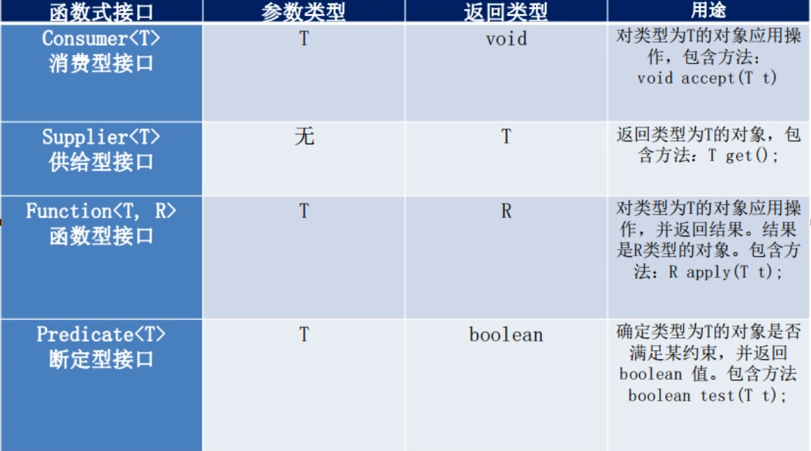  

## ForkJoinPool....

分支合并框架。  

ForkJoinPool, ForkJoinTask, RecursiveTask  

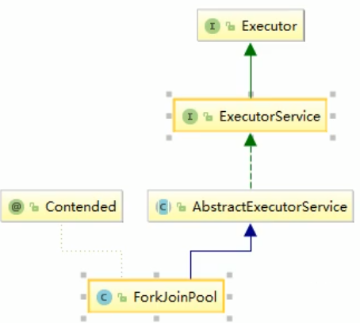

把大任务分解成小任务，来并行执行(fork)，计算完后再合并起来(join)

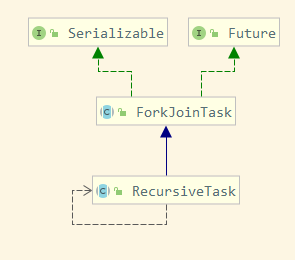

## 异步回调

**CompletableFuture**  

可以实现无返回调用，也可以实现有返回调用  

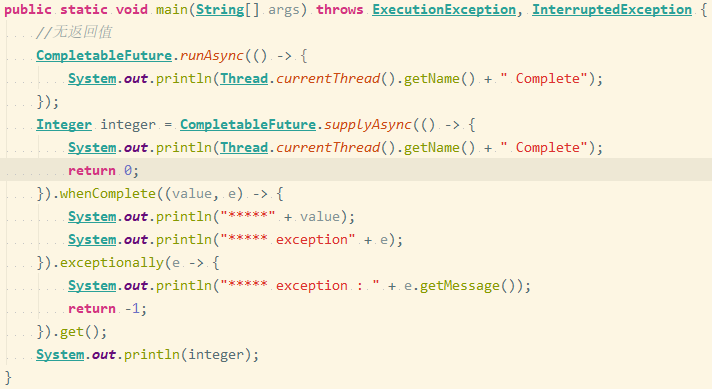  

# HashMap

## 类继承结构

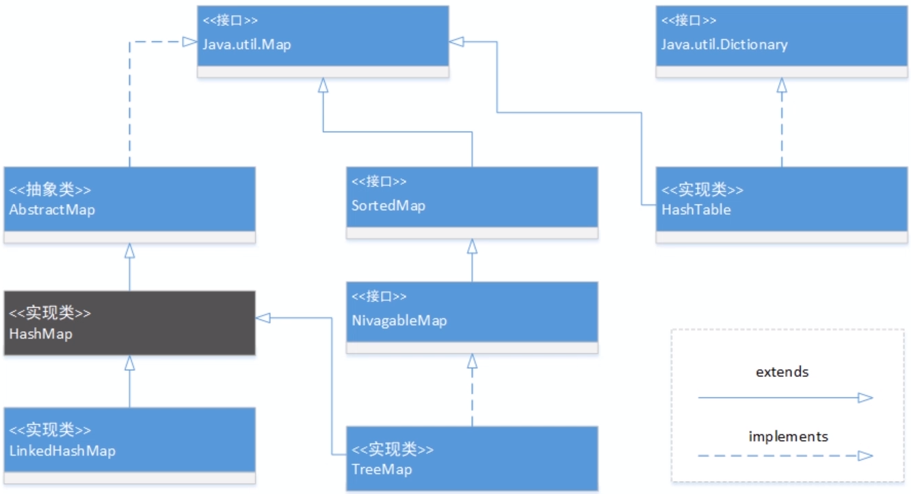

## 底层数组存储结构

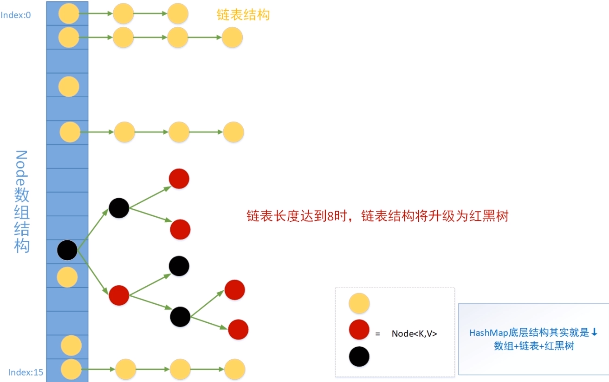  

## Integer.highestOneBit(i)

获得i这个数二进制形式最左边的最高位为1，其他位补零的数。实际效果就是，返回给定数字的向下最接近2次幂的数字。例如9，向下最接近2次幂的数就为8。  

https://blog.csdn.net/jessenpan/article/details/9617749

## JDK1.7 roundUpToPowerOf2(i) ----- JDK 1.8 tableSizeFor(i)

```java
//1.8
static final int tableSizeFor(int cap) {
    int n = cap - 1;
    n |= n >>> 1;
    n |= n >>> 2;
    n |= n >>> 4;
    n |= n >>> 8;
    n |= n >>> 16;
    return (n < 0) ? 1 : (n >= MAXIMUM_CAPACITY) ? MAXIMUM_CAPACITY : n + 1;
}
```

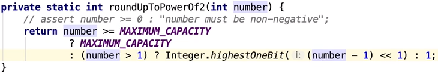  

获得给定数字向上最靠近2次幂的数字，例如9，那么获得的就是16这个数字。**减一是考虑了当给定的数字就是2次幂的情况**  

## 为什么数组长度要为2次幂

1、方便用与运算来替代取模操作

```java
//1.8
if ((p = tab[i = (n - 1) & hash]) == null)
//1.7用的是indexFor方法，内容是一样的
```

> 例如数组长度为16，hashcode为0101 1010，得到数组下标的运算为 hashcode & (length - 1)
>
> 那么  length - 1 = 0000 1111
>
> ​         hashcode = 0101 1010
>
> 做一次与运算得到 0000 1010，正好是取模的值，由此也可以看出，长度-1之后，位为1的区段就是数组的取值范围

## 为什么获得hashcode之后，高16位要与低16位进行与运算

```java
//1.8
static final int hash(Object key) {
    int h;
    return (key == null) ? 0 : (h = key.hashCode()) ^ (h >>> 16);
}
```

因为，与运算，两个位只要有一位变化，结果也会发生变化。这样让高位也参与运算，提高散列性。  

同时由于，刚开始hashmap的数组长度很小，在进行与运算的时候，hashcode参与运算的位数基本在低16位当中，所以需要让高位也参与到计算当中

## JDK7u80与JDK1.8的扩容条件与时机不同

在1.7中，扩容有两个条件  

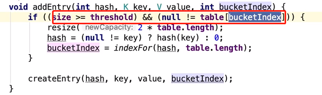  

1、当前size大于阈值  

2、**当前所要放入的数组所在位置不为空**  

并且，插入元素之前先判断需不需要扩容

而1.8中，则是先插入元素再判断需不需要扩容

## JDK1.7与1.8新增元素的插入位置不同

1.7当中，是用头插法将hash冲突的元素插入到链表当中  

1.8当中，是用尾插法将hash冲突的元素插入到链表当中  

**1.8的Hashmap将头插法改成尾插法，目的是解决多线程环境下扩容时链表死循环的问题**

## JDK1.8中链表转为红黑树的条件

1、链表长度超过TREEIFY_THRESHOLD(默认是8)

2、哈希表中所有元素超过MIN_TREEIFY_CAPACITY(默认是64)

## Put方法

```java
final V putVal(int hash, K key, V value, boolean onlyIfAbsent, boolean evict) {
    //tab: 引用当前HashMapde 散列表
    //p: 表示当前的散列表元素
    //n: 表示散列表数组的长度
    //i: 表示路由寻址的结果(也就是数据要放入数组位置的下标)
    Node<K,V>[] tab; Node<K,V> p; int n, i;
    
    //延迟初始化逻辑，第一次调用putVal时会初始化HashMap对象中的最耗费内存的散列表
    if ((tab = table) == null || (n = tab.length) == 0)
        n = (tab = resize()).length;
    //如果找到的位置没有数据，则将当前KV封装成Node对象并放入数组当中
    if ((p = tab[i = (n - 1) & hash]) == null)
        tab[i] = newNode(hash, key, value, null);
    else {
        //e: 不为null的话，找到了一个与当前要插入的kv一致key的元素
        //k: 表示临时的一个key
        Node<K,V> e; K k;
        
        //表示位置中的该元素与你当前插入的元素的key完全一致，表示后续需要进行替换操作
        if (p.hash == hash &&
            ((k = p.key) == key || (key != null && key.equals(k))))
            e = p;
        //是否已经树化
        else if (p instanceof TreeNode)
            e = ((TreeNode<K,V>)p).putTreeVal(this, tab, hash, key, value);
        else {
            for (int binCount = 0; ; ++binCount) {
                //如果已经到了链表尾部也没找到一个与当前要插入的key一致的node，则将KV插入链表尾部
                if ((e = p.next) == null) {
                    p.next = newNode(hash, key, value, null);
                    //判断链表长度如果大于等于树化阈值，则将链表树化，-1是因为bincount是从0开始
                    if (binCount >= TREEIFY_THRESHOLD - 1) // -1 for 1st
                        //树化操作
                        treeifyBin(tab, hash);
                    break;
                }
                //找到了与当前需要插入kv的node
                if (e.hash == hash &&
                    ((k = e.key) == key || (key != null && key.equals(k))))
                    break;
                p = e;
            }
        }
        //e不等于null，条件成立说明找到了一个与当前插入元素key完全一致的数据，需要进行替换
        if (e != null) { // existing mapping for key
            V oldValue = e.value;
            if (!onlyIfAbsent || oldValue == null)
                e.value = value;
            afterNodeAccess(e);
            //返回旧值
            return oldValue;
        }
    }
    //表示散列表结构被修改次数，替换Node元素中的value不计数(也就是更新元素)
    ++modCount;
    //插入新元素，size自增，判断自增后的大小是否需要扩容
    if (++size > threshold)
        resize();
    afterNodeInsertion(evict);
    return null;
}
```

## resize方法-扩容

为什么需要扩容：为了解决哈希冲突导致的链化影响查询效率问题，扩容会缓解该问题。  

```java
final Node<K,V>[] resize() {
    //oldTab: 引用扩容前的哈希表
    Node<K,V>[] oldTab = table;
    //oldCap: 表示扩容之前table数组的长度
    int oldCap = (oldTab == null) ? 0 : oldTab.length;
    //oldThr: 表示扩容之前的扩容阈值，触发本次扩容的阈值
    int oldThr = threshold;
    //newCap: 扩容之后table数组的大小
    //newThr: 扩容之后再次触发扩容的条件
    int newCap, newThr = 0;
    //条件成立说明，HashMap中的散列数组已经初始化过了，是一次正常的扩容
    if (oldCap > 0) {
        //如果当前长度大于等于最大长度，则设置长度为上限，并直接返回旧table，表示无法再扩容
        if (oldCap >= MAXIMUM_CAPACITY) {
            threshold = Integer.MAX_VALUE;
            return oldTab;
        }
        //正常扩容，oldCap左移一位实现翻倍，并且赋值给newCap，newCap小于数组最大值限制 且 扩容之前阈值>=16
        //这种情况下，下一次扩容阈值等于当前阈值翻倍
        else if ((newCap = oldCap << 1) < MAXIMUM_CAPACITY &&
                 oldCap >= DEFAULT_INITIAL_CAPACITY)
            newThr = oldThr << 1; // double threshold
    }
    //oldCap == 0，说明HashMap中的散列表是null，在以下几种情况，oldThr会不为0
    //1.new HashMap(initCap, loadFactor)
    //2.new HashMap(initCap)
    //3.new HashMap(map)，并且这个Map有数据
    else if (oldThr > 0) // initial capacity was placed in threshold
        newCap = oldThr;
    //oldCap = 0, oldThr = 0
    //只会在调用new HashMap()的时候走到
    else {               // zero initial threshold signifies using defaults
        newCap = DEFAULT_INITIAL_CAPACITY; //16
        newThr = (int)(DEFAULT_LOAD_FACTOR * DEFAULT_INITIAL_CAPACITY);  //12
    }
    //newThr为0时，通过newCap和loadFactor计算出一个newThr
    if (newThr == 0) {
        float ft = (float)newCap * loadFactor;
        newThr = (newCap < MAXIMUM_CAPACITY && ft < (float)MAXIMUM_CAPACITY ?
                  (int)ft : Integer.MAX_VALUE);
    }
    threshold = newThr;
    @SuppressWarnings({"rawtypes","unchecked"})
    Node<K,V>[] newTab = (Node<K,V>[])new Node[newCap];
    table = newTab;
    //说明，HashMap本次扩容之前数组已经创建
    if (oldTab != null) {
        
        for (int j = 0; j < oldCap; ++j) {
            //当前Node节点
            Node<K,V> e;
            //成立，表示数组当前位置有数据
            if ((e = oldTab[j]) != null) {
                //方便JVM GC时回收内存
                oldTab[j] = null;
                //第一种情况: 表示此处未产生hash碰撞，直接将元素重新计算位置即可
                if (e.next == null)
                    newTab[e.hash & (newCap - 1)] = e;
                //第二种情况: 当前节点已经树化
                else if (e instanceof TreeNode)
                    ((TreeNode<K,V>)e).split(this, newTab, j, oldCap);
                else { // preserve order
                    //第三种情况，当前位置已经形成链表
                    //低位链表: 存放在扩容之后的数组的下标位置，与当前数组的下标位置一致
                    Node<K,V> loHead = null, loTail = null;
                    //高位链表: 存放在扩容之后的数组的下标位置为 当前数组下标位置 + 扩容之前的数组长度
                    Node<K,V> hiHead = null, hiTail = null;
                    Node<K,V> next;
                    //将链表中的元素拆分成低位链表与高位链表
                    do {
                        next = e.next; 
                        if ((e.hash & oldCap) == 0) {
                            if (loTail == null)
                                loHead = e;	
                            else
                                loTail.next = e;
                            loTail = e;
                        }
                        else {
                            if (hiTail == null)
                                hiHead = e;
                            else
                                hiTail.next = e;
                            hiTail = e;
                        }
                    } while ((e = next) != null);
                    if (loTail != null) {
                        //这里的next可能会指向旧值，由于低位链表已到了末尾，直接赋null即可
                        loTail.next = null;
                        newTab[j] = loHead;
                    }
                    if (hiTail != null) {
                        hiTail.next = null;
                        newTab[j + oldCap] = hiHead;
                    }
                }
            }
        }
    }
    return newTab;
}
```

## get方法

```java
final Node<K,V> getNode(int hash, Object key) {
    //tab: 引用当前HashMap的散列表
    //first: 桶位中的头元素
    //e: 临时node元素
    //n: table数组长度
    Node<K,V>[] tab; Node<K,V> first, e; int n; K k;
    
    if ((tab = table) != null && (n = tab.length) > 0 &&
        (first = tab[(n - 1) & hash]) != null) {
        if (first.hash == hash && // always check first node
            ((k = first.key) == key || (key != null && key.equals(k))))
            return first;
        if ((e = first.next) != null) {
            if (first instanceof TreeNode)
                return ((TreeNode<K,V>)first).getTreeNode(hash, key);
            do {
                if (e.hash == hash &&
                    ((k = e.key) == key || (key != null && key.equals(k))))
                    return e;
            } while ((e = e.next) != null);
        }
    }
    return null;
}
```

## remove方法

```java
public V remove(Object key) {
    Node<K,V> e;
    return (e = removeNode(hash(key), key, null, false, true)) == null ?
        null : e.value;
}
```

```java
final Node<K,V> removeNode(int hash, Object key, Object value,
                           boolean matchValue, boolean movable) {
    //tab: 引用当前HashMap中的散列表
    //p: 当前Node元素
    //n: 表示散列表长度
    //index: 表示寻址结果
    Node<K,V>[] tab; Node<K,V> p; int n, index;
    //判断散列表是否存在，位置是否为空
    if ((tab = table) != null && (n = tab.length) > 0 &&
        (p = tab[index = (n - 1) & hash]) != null) {
        //进入if说明桶位是有数据的，需要进行查找操作，并且删除
        //node: 查找到的结果
        //e: 当前node的下一个元素
        Node<K,V> node = null, e; K k; V v;
        if (p.hash == hash &&
            ((k = p.key) == key || (key != null && key.equals(k))))
            node = p;
        else if ((e = p.next) != null) {
            //到这个分支说明当前桶位要么是链表，要么是红黑树
            if (p instanceof TreeNode)
                node = ((TreeNode<K,V>)p).getTreeNode(hash, key);
            else {
                do {
                    if (e.hash == hash &&
                        ((k = e.key) == key ||
                         (key != null && key.equals(k)))) {
                        node = e;
                        break;
                    }
                    p = e;
                } while ((e = e.next) != null);
            }
        }
        //判断node不为空表示根据key查找到了需要删除的数据
        if (node != null && (!matchValue || (v = node.value) == value ||
                             (value != null && value.equals(v)))) {
            if (node instanceof TreeNode)
                ((TreeNode<K,V>)node).removeTreeNode(this, tab, movable);
            else if (node == p)
                tab[index] = node.next;
            else
                p.next = node.next;
            ++modCount;
            --size;
            afterNodeRemoval(node);
            return node;
        }
    }
    return null;
}
```

## replace方法

内部使用的就是get方法所调用的getNode方法

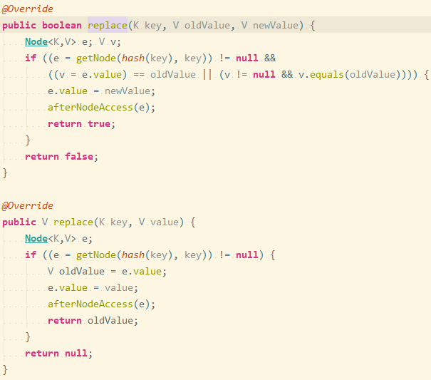

# Java 集合接口

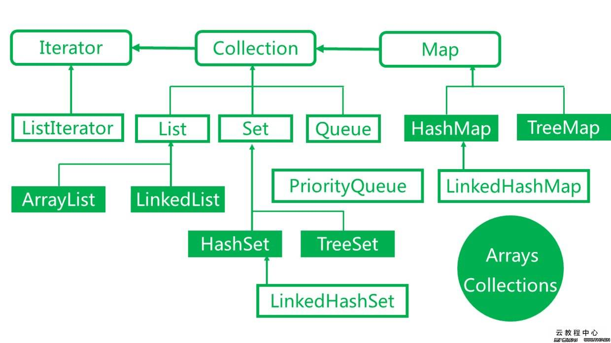

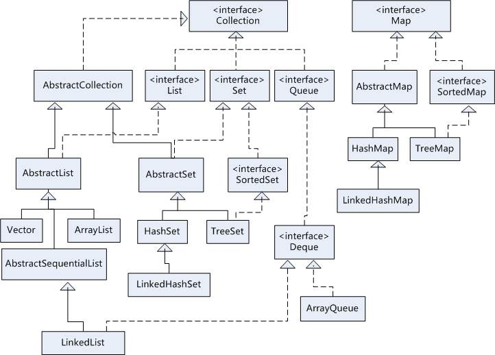

# 标记型接口

## Serializable

## Cloneable

## RandomAccess

此接口以表示实现类支持快速(通常为恒定时间)随机访问。  

此接口的主要目的是允许通用算法更改其行为，以便于在应用于随机访问列表或顺序访问列表时提供良好的性能。

所以，实现了该接口之后，该集合的随机访问效率是要高于顺序访问的。

### 随机访问

```java
for(int i = 0;i < list.size();i++) list.get(i);
```

### 顺序访问

```java
for(Iterator i = list.iterator(); i.hasNext();) i.next()
```

### 开发经验

当接收到一个List的子类对象的时候，可以判断子类是否有实现RandomAccess接口，通过以上判断来采取不同的遍历方式。(主要针对ArrayList与LinkedList)，如果实现：推荐使用随机访问的方式进行遍历；否则，使用顺序访问遍历  

# IO

## NIO

Java NIO(Non-Blocking IO) 是从Java1.4版本开始引入的一套新的IO API，可以替代标准的Java IO API。NIO与原来的IO有同样的作用和目的，但是使用的方式完全不同，NIO支持面向缓冲区的(IO是面向流的)、基于通道的IO操作。NIO将以更高效的方式进行文件的读写操作  

Java API中提供了两套NIO，一套是针对标准输入输出NIO，另一套就是网络编程NIO  

java.nio.channels.Channel  
  FileChannel:处理本地文件  
  SocketChannel:TCP网络编程的客户端Channel  
  ServerSocketChannel:TCP网络编程的服务器端的Channel  
  DatagramChannel:UDP网络编程中发送端和接收端的Channel  


Java NIO系统的核心在于：通道(Channel)和缓冲区(Buffer)。通道便是打开到IO设备(例如文件，套接字)的链接。若需要使用NIO系统，需要获取用于连接IO设备的通道以及用于容纳数据的缓冲区。然后操作缓冲区，对数据进行处理。  

**简而言之，Channel负责传输，Buffer负责存储**  

### Channel
Channel表示IO源与目标打开的连接。Channel类似与传统的"流"。只不过Channel本身不能直接访问数据，Channel只能与Buffer进行交互。  

早期  

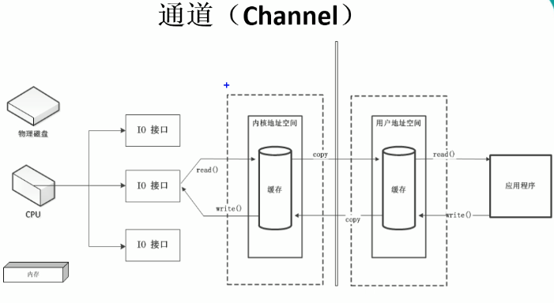  

改进  

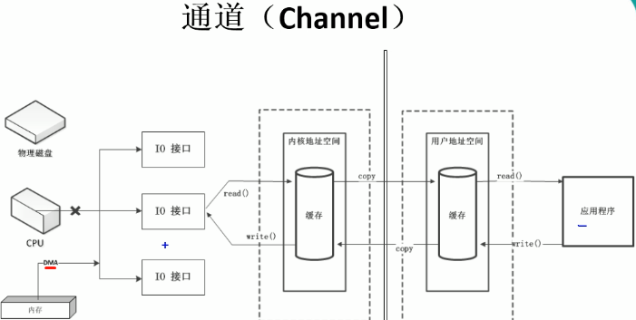 

> DMA(Direct Memory Access，直接存储器访问) 是所有现代电脑的重要特色，它允许不同速度的硬件装置来沟通，而不需要依赖于 CPU 的大量中断负载。否则，CPU 需要从来源把每一片段的资料复制到暂存器，然后把它们再次写回到新的地方。在这个时间中，CPU 对于其他的工作来说就无法使用。
>
> DMA 传输将数据从一个地址空间复制到另外一个地址空间。当CPU 初始化这个传输动作，传输动作本身是由 DMA 控制器来实行和完成。典型的例子就是移动一个外部内存的区块到芯片内部更快的内存区。像是这样的操作并没有让处理器工作拖延，反而可以被重新排程去处理其他的工作。DMA 传输对于高效能 嵌入式系统算法和网络是很重要的。
>
> 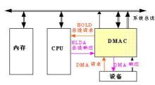  
>
> 在实现DMA传输时，是由DMA控制器直接掌管总线，因此，存在着一个总线控制权转移问题。即DMA传输前，CPU要把总线控制权交给DMA控制器，而在结束DMA传输后，DMA控制器应立即把总线控制权再交回给CPU。一个完整的DMA传输过程必须经过DMA请求、DMA响应、DMA传输、DMA结束4个步骤

通道  

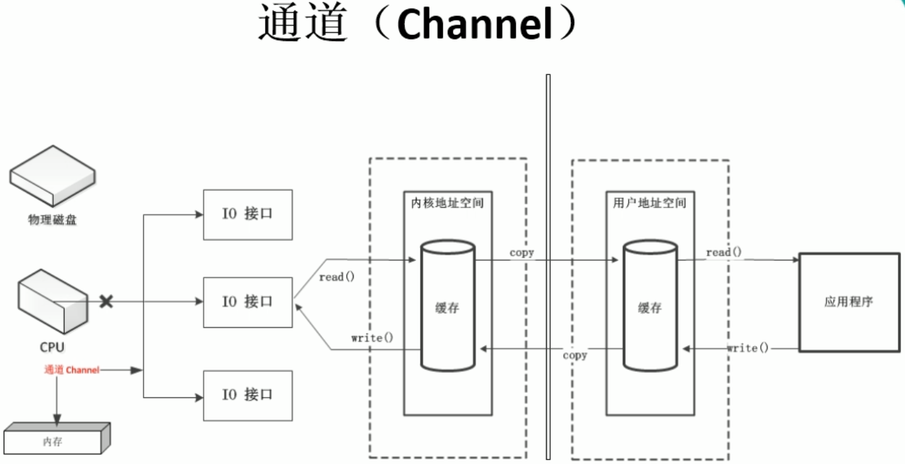  

 由于DMA也是要向CPU去获取总线控制权的，当大量的IO请求进来时，CPU的利用率也会下降，因为要处理来自DMA的总线控制权的请求。  

而通道不需要向CPU请求，所以相对于DMA操作性能要高一些

#### 获取

获取通道的三种方式：  

1、Java针对支持通道的类提供了getChannel()方法  

  本地IO: FileInputStream/FileOutputStream, RandomAccessFile  

  网络IO: Socket, ServerSocket, DatagramSocket  

2、在JDK1.7中的NIO.2针对各个通道提供了静态方法open()  

3、在JDK1.7中的NIO.2的Files工具类的newByteChannel()  

#### 通道间的数据传输

也是通过直接缓冲区的方式  

transferTo()  

transferFrom()  

#### 分散读取与聚集写入

分散读取(Scattering Read) :   将通道中的数据分散到多个缓冲区中  

聚集写入(Gathering Writes) : 将多个缓冲区中的数据聚集到通道中

### 缓冲区

一个用于特定基本数据类型的容器。有java.nio包定义的，所有缓冲区都是Buffer抽象类的子类  

NIO中的Buffer主要用于与NIO通道进行交互，数据是从通道读入缓冲区，从缓冲区写入通道中的。  

#### 直接缓冲区

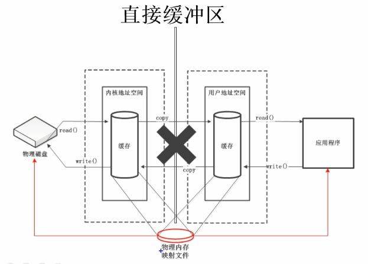  

通过allocateDirect()方法分配直接缓冲区，将缓冲区建立在本地内存中，可以提高效率。  

如果分配直接字节缓冲区，则Java虚拟机会尽最大努力直接在此缓冲区上执行本机I/O操作。也就是说，在每次调用基础操作系统的一个本机I/O操作之前(或之后)，虚拟机都会尽量避免将缓冲区的内容复制到中间缓冲区中(或从中间缓冲区中复制内容)  

直接字节缓冲区可以通过调用allocateDirect()工厂方法来创建。此方法返回的**缓冲区进行分配和取消分配所需成本通常高于非直接缓冲区**。直接缓冲区的内容可以驻留在常规的垃圾回收堆之外。因此，它们对应用程序的内存需求量造成的影响可能并不明显。所以，建议将直接缓冲区主要分配给那些易受基础系统的本机I/O操作影响的大型、持久的缓冲区。一般情况下，最好仅在直接缓冲区能在程序性能方面带来明显好处时分配它们。  

直接字节缓冲区还可以通过**FileChannel的map()方法**，将文件区域直接映射到内存中来创建。该方法返回**MappedByteByteBuffer**。Java平台的实现有助于通过JNI从本机代码创建直接字节缓冲区。如果以上这些缓冲区中的某个缓冲区实例指的是不可访问的内存区域，则试图访问该区域时不会更改该缓冲区的内容，并且将会在某个访问期间内或稍后的某个时间导致抛出不确定的异常。  

字节缓冲区是直接缓冲区还是非直接缓冲区可通过调用isDirect()方法来确定

#### 非直接缓冲区

通过allocate()方法分配缓冲区，将缓冲区建立在JVM的堆内存中。  

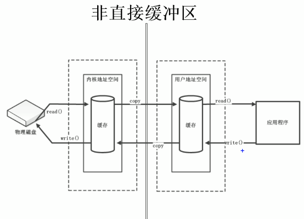  


### 网络通信

#### 阻塞与非阻塞

传统的 IO 流都是阻塞式的。也就是说，当一个线程调用 read() 或 write() 时，该线程被阻塞，直到有一些数据被读取或写入，该线程在此期间不 能执行其他任务。因此，在完成网络通信进行 IO 操作时，由于线程会 阻塞，所以服务器端必须为每个客户端都提供一个独立的线程进行处理， 当服务器端需要处理大量客户端时，性能急剧下降。  

Java NIO 是非阻塞模式的。当线程从某通道进行读写数据时，若没有数 据可用时，该线程可以进行其他任务。线程通常将非阻塞 IO 的空闲时 间用于在其他通道上执行 IO 操作，所以单独的线程可以管理多个输入 和输出通道。因此，NIO 可以让服务器端使用一个或有限几个线程来同 时处理连接到服务器端的所有客户端。  

### 选择器

选择器（Selector） 是 SelectableChannle 对象的多路复用器，Selector 可 以同时监控多个 SelectableChannel 的 IO 状况，也就是说，利用 Selector 可使一个单独的线程管理多个 Channel。Selector 是非阻塞 IO 的核心。

SelectableChannel结构如下：  

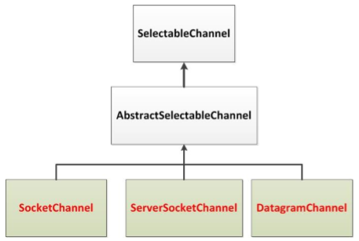  

> 当调用 register(Selector sel, int ops)  将通道注册选择器时，选择器 对通道的监听事件，需要通过第二个参数 ops 指定。  
> 可以监听的事件类型（可使用 SelectionKey 的四个常量表示）：  
> 读 : SelectionKey.OP_READ  （1）  
> 写 : SelectionKey.OP_WRITE    （4）  
> 连接 : SelectionKey.OP_CONNECT （8）  
> 接收 : SelectionKey.OP_ACCEPT  （16）  
>
> 若注册时不止监听一个事件，则可以使用“位或”操作符连接。  
>
> 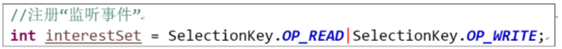  


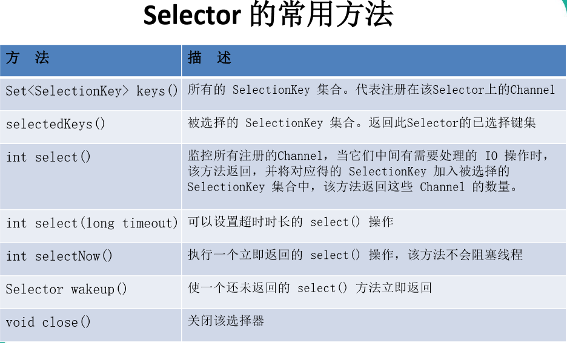  

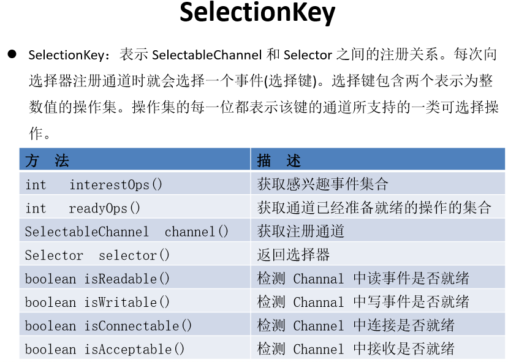  


### 区别

| IO                      | NIO                         |
| ----------------------- | --------------------------- |
| 面向流(Stream oriented) | 面向缓冲区(Buffer Oriented) |
| 阻塞IO(Blocking IO)     | 非阻塞IO(Non Blocking IO)   |
| (无)                    | 选择器(Selectors)           |

## IO多路复用

### select

select是一个阻塞函数，直到有fd有数据，会将有数据fd在bitmap中的位为1，之后返回，其实就是在轮询判断，只不过将轮询的动作交到了内核态执行，这样减少了上下文的切换(用户直接轮询FD，其实也就是在询问内核FD是否准备就绪，这样涉及到了用户态和内核态的切换，效率不高)

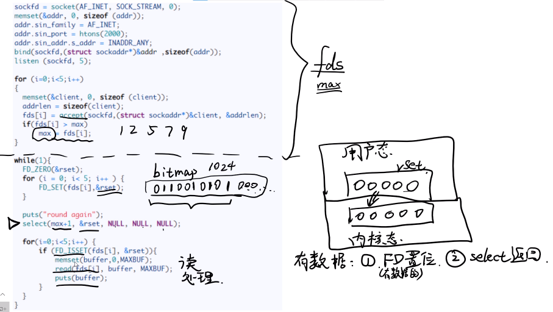  

select工作流程：

将需要判断的文件FD(文件描述符File Description)收集起来，并交给内核来进行轮询判断哪一个FD有数据，当有一个FD或多个FD有数据时，select函数会返回，并且有数据的FD会被置位。之后用户再自己遍历FD的集合，找到被置位的FD，进行相应的操作

#### 缺点

1、默认指示FD的bitmap大小是1024

2、fd_set每次循环都要重新创建，不可重用

3、虽然rset从用户态拷贝到了内核态，但是仍然需要进行两次用户态和内核态的切换

4、不能明确知道哪一个FD被置位，需要一次遍历FD集合，O(n)

### poll

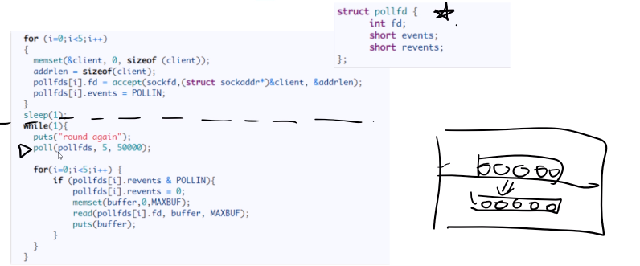  

events表示关心哪个事件：读， pollin事件 ；写，pollout事件，都在意，两者或运算一下就可以  

当有FD有数据的时候pollfd中的revents会被置位，接下来只要判断revents是否是POLLIN，如果是则进行数据的相关操作，并将revents置回0  

#### 解决问题

解决了select的FD的bitmap长度限制为1024的问题  

解决了FD_SET不能重用的问题  

### epoll

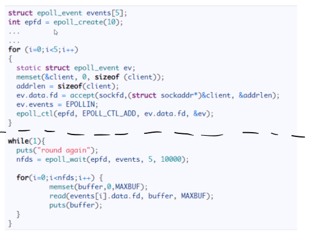  

**epoll_create** : 该函数生成一个epoll专用的文件描述符。它其实是在内核申请一空间，用来存放你想关注的socket fd上是否发生以及发生了什么事件。size就是你在这个epoll fd上能关注的最大socket fd数。随你定好了。只要你有空间。可参见上面与select之不同  

> 创建一个epoll的句柄，size用来告诉内核这个监听的数目一共有多大。这个参数不同于select()中的第一个参数，给出最大监听的fd+1的值。需要注意的是，当创建好epoll句柄后，它就是会占用一个fd值，在linux下如果查看/proc/进程id/fd/，是能够看到这个fd的，所以在使用完epoll后，必须调用close()关闭，否则可能导致fd被耗尽  

**epoll_ctl** : epoll的事件注册函数，它不同与select()是在监听事件时告诉内核要监听什么类型的事件，而是在这里先注册要监听的事件类型。  

> 函数声明：int epoll_ctl(int epfd, int op, int fd, struct epoll_event \*event)
> 该函数用于控制某个epoll文件描述符上的事件，可以注册事件，修改事件，删除事件。
> 参数：
> epfd：由 epoll_create 生成的epoll专用的文件描述符；
> op：要进行的操作例如注册事件，可能的取值EPOLL_CTL_ADD 注册、EPOLL_CTL_MOD 修 改、EPOLL_CTL_DEL 删除
> fd：关联的文件描述符；
> event：指向epoll_event的指针；
> 如果调用成功返回0,不成功返回-1
>
> 或者这个解释：
> 第一个参数是epoll_create()的返回值，
> 第二个参数表示动作，用三个宏来表示：
> EPOLL_CTL_ADD：       注册新的fd到epfd中；
> EPOLL_CTL_MOD：      修改已经注册的fd的监听事件；
> EPOLL_CTL_DEL：        从epfd中删除一个fd；
> 第三个参数是需要监听的fd，
> 第四个参数是告诉内核需要监听什么事件
>
> events可以是以下几个宏的集合：
>        EPOLLIN：            触发该事件，表示对应的文件描述符上有可读数据。(包括对端SOCKET正常关闭)；
>        EPOLLOUT：         触发该事件，表示对应的文件描述符上可以写数据；
>        EPOLLPRI：           表示对应的文件描述符有紧急的数据可读（这里应该表示有带外数据到来）；
>        EPOLLERR：        表示对应的文件描述符发生错误；
>        EPOLLHUP：        表示对应的文件描述符被挂断；
>        EPOLLET：           将EPOLL设为边缘触发(Edge Triggered)模式，这是相对于水平触发(Level Triggered)来说的。
>        EPOLLONESHOT：  只监听一次事件，当监听完这次事件之后，如果还需要继续监听这个socket的话，需要再次把这个socket加入到EPOLL队列里。

**epoll_wait(int epfd, struct epoll_event * events, intmaxevents, int timeout)**

该函数用于轮询I/O事件的发生；

> 参数：
> epfd:由epoll_create 生成的epoll专用的文件描述符；
> epoll_event:用于回传待处理事件的数组；
> maxevents:每次能处理的事件数；
> timeout:等待I/O事件发生的超时值(单位我也不太清楚)；-1相当于阻塞，0相当于非阻塞。一般用-1即可
> 返回发生事件数。
>
> 参数events用来从内核得到事件的集合，maxevents告之内核这个events有多大(数组成员的个数)，这个maxevents的值不能大于创建epoll_create()时的size，参数timeout是超时时间（毫秒，0会立即返回，-1将不确定，也有说法说是永久阻塞）。

epoll会把有数据的FD放到epoll_event当中，之后返回触发事件的个数

epoll解决了用户态到内核态的开销，因为epfd所使用的内存是内核态与用户态共享的  

也解决了寻找有数据的FD需要遍历所有FD的问题。

# 反射

Reflection(反射)是被视为动态语言的关键，反射机制允许程序在执行期借助于Reflection API取得任何类的内部信息，并能直接操作任意对象的内部属性及方法。  

加载完类之后，在堆内存的方法区中就产生了一个Class类型的对象(一个类只有一个Class对象)，这个对象就包含了完整的类的结构信息。我们可以通过这个对象看到类的结构。这个对象就像一面镜子，透过这个镜子看到类的结构，所以，我们形象的称之为：**反射**  

  

> 动态语言：
>
> 是一类在运行时可以改变其结构的语言：例如新的函数、对象、甚至代码可以被引进，已有的函数可以被删除或者是其他结构上的变化。通俗点说就是在运行时代码可以根据某些条件改变自身结构
>
> 主要动态语言：Object-C, C#, JavaScript, PHP, Python, Erlang
>
> 静态语言：
>
> 与动态语言相对对应，运行时结构不变的语言就是静态语言。如Java、C、C++
>
> Java不是动态语言，但Java可以称之为“准动态语言”，即Java有一定动态性。我们可以利用反射机制 、字节码操作获得类似动态语言的特性，Java的动态性让编程的时候更加灵活。

## 面试问题

0、什么时候用反射  

在编译器无法确定到底要生成什么对象的时候，就可以使用反射  

1、反射机制与面向对象中的封装性是不是矛盾的？如何看待这两种技术？

不矛盾，反射是我能不能调的问题，封装性是建议不建议调的问题 

## Class

> 获取Class对象的实例的四种方法:
>
> Person.class
>
> new Person().getClass()
>
> Class.forName("com.xc.Persion")
>
> Test.class.getClassLoader().loadClass("com.xc.Persion")

以下7中类型可以有Class对象

1、class：外部类，成员(成员内部类，静态内部类)，局部内部类，匿名内部类  

2、interface：接口  

3、[]：数组

4、enum：枚举  

5、annotation：注解

6、primitive type：基本数据类型

7、void  

## 动态代理

> 代理设计模式:
>
> 使用一个代理将对象包装起来，然后用该代理对象取代原始对象。任何对原始对象的调用都要通过代理。代理对象决定是否以及何时将方法调用转到原始对象上。

动态代理是指客户通过代理类来调用其他对象的方法，并且是在程序运行时根据需要，动态创建目标类的代理对象。  

动态代理使用场合：

1. 调试

2. 远程方法调用

动态代理相比于静态代理的优点：  

抽象角色中(接口)声明的所有方法都被转移到调用处理器一个集中的方法中处理，这样，我们可以更加灵活和统一的处理众多的方法。  

# AQS(AbstractQueueSynchronizer)

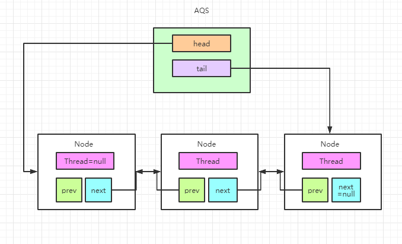  

## ReentrantLock

>  **通过剖析可重入公平锁的加锁与解锁来理解AQS工作原理**  

### 公平锁加锁

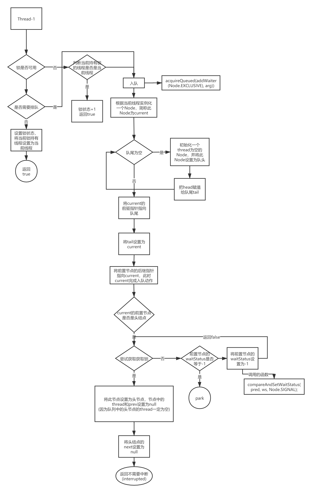  

简易版流程，具体要结合源码进行阅读  

**AbstractQueuedSynchronizer主要变量**

```java
private transient volatile Node head; //队首
private transient volatile Node tail;//尾
private volatile int state;//锁状态，加锁成功则为1，重入+1 解锁则为0
```

```java
public class Node{
    volatile Node prev;
    volatile Node next;
    //关联的线程
    volatile Thread thread;
    //节点状态
    volatile int waitStatus;
}
```

#### acquire

```java
public final void acquire(int arg) {
    //tryAcquire(arg)尝试加锁，如果加锁失败则会调用acquireQueued方法加入队列去排队，如果加锁成功则不会调用
    //acquireQueued方法下文会有解释
    //加入队列之后线程会立马park，等到解锁之后会被unpark，醒来之后判断自己是否被打断了；被打断下次分析
    //为什么需要执行这个方法？下文解释
    if (!tryAcquire(arg) &&
        acquireQueued(addWaiter(Node.EXCLUSIVE), arg))
        selfInterrupt();
}
```

#### tryAcquire

```java
protected final boolean tryAcquire(int acquires) {
    //获取当前线程
    final Thread current = Thread.currentThread();
    //获取lock对象的上锁状态，如果锁是自由状态则=0，如果被上锁则为1，大于1表示重入
    int c = getState();
    if (c == 0) {//没人占用锁--->我要去上锁----1、锁是自由状态
        //hasQueuedPredecessors，判断自己是否需要排队这个方法比较复杂，
        //下面我会单独介绍，如果不需要排队则进行cas尝试加锁，如果加锁成功则把当前线程设置为拥有锁的线程
        //继而返回true
        if (!hasQueuedPredecessors() &&
            compareAndSetState(0, acquires)) {
            //设置当前线程为拥有锁的线程，方面后面判断是不是重入（只需把这个线程拿出来判断是否当前线程即可判断重入）    
            setExclusiveOwnerThread(current);
            return true;
        }
    }
    //如果C不等于0，而且当前线程不等于拥有锁的线程则不会进else if 直接返回false，加锁失败
    //如果C不等于0，但是当前线程等于拥有锁的线程则表示这是一次重入，那么直接把状态+1表示重入次数+1
    //那么这里也侧面说明了reentrantlock是可以重入的，因为如果是重入也返回true，也能lock成功
    else if (current == getExclusiveOwnerThread()) {
        int nextc = c + acquires;
        if (nextc < 0)
            throw new Error("Maximum lock count exceeded");
        setState(nextc);
        return true;
    }
    return false;
}
```

#### hasQueuedPredecessors

> 这里需要记住一点，整个方法如果最后返回false，则去加锁，如果返回true则不加锁，因为这个方法被取反了

```java
public final boolean hasQueuedPredecessors() {
    Node t = tail; 
    Node h = head;
    Node s;
    /**
     * 下面提到的所有不需要排队，并不是字面意义，我实在想不出什么词语来描述这个“不需要排队”；不需要排队有两种情况
     * 一：队列没有初始化，不需要排队；直接去加锁，但是可能会失败；为什么会失败呢？
     * 假设两个线程同时来lock，都看到队列没有初始化，都认为不需要排队，都去进行CAS修改计数器；有一个必然失败
     * 比如t1先拿到锁，那么另外一个t2则会CAS失败，这个时候t2就会去初始化队列，并排队
     *
     * 二：队列被初始化了，但是tc过来加锁，发觉队列当中第一个排队的就是自己；比如重入；
     * 那么什么叫做第一个排队的呢？下面解释了，很重要往下看；
     * 这个时候他也不需要排队；为什么不需要排队？
     * 因为队列当中第一个排队的线程他会去尝试获取一下锁，因为有可能这个时候持有锁锁的那个线程可能释放了锁；
     * 如果释放了就直接获取锁执行。但是如果没有释放他就会去排队，
     * 所以这里的不需要排队，不是真的不需要排队
     *
     * h != t 判断首不等于尾这里要分三种情况
     * 1、队列没有初始化，也就是第一个线程tf来加锁的时候那么这个时候队列没有初始化，
     * h和t都是null，那么这个时候判断不等于则不成立（false）那么由于是&&运算后面的就不会走了，
     * 直接返回false表示不需要排队，而前面又是取反（if (!hasQueuedPredecessors()），所以会直接去cas加锁。
     * ----------第一种情况总结：队列没有初始化没人排队，那么我直接不排队，直接上锁；合情合理、有理有据令人信服；
     * 好比你去火车站买票，服务员都闲的蛋疼，整个队列都没有形成；没人排队，你直接过去交钱拿票
     *
     * 2、队列被初始化了，后面会分析队列初始化的流程，如果队列被初始化那么h!=t则成立；（不绝对，还有第3中情况）
     * h != t 返回true；但是由于是&&运算，故而代码还需要进行后续的判断
     * （有人可能会疑问，比如队列初始化了；里面只有一个数据，那么头和尾都是同一个怎么会成立呢？
     * 其实这是第3种情况--队头等于队尾；但是这里先不考虑，我们假设现在队列里面有大于1个数据）
     * 大于1个数据则成立;继续判断把h.next赋值给s；s有是队头的下一个Node，
     * 这个时候s则表示他是队列当中参与排队的线程而且是排在最前面的；
     * 为什么是s最前面不是h嘛？诚然h是队列里面的第一个，但是不是排队的第一个；下文有详细解释
     * 因为h也就是对头对应的Node对象或者线程他是持有锁的，但是不参与排队；
     * 这个很好理解，比如你去买车票，你如果是第一个这个时候售票员已经在给你服务了，你不算排队，你后面的才算排队；
     * 队列里面的h是不参与排队的这点一定要明白；参考下面关于队列初始化的解释；
     * 因为h要么是虚拟出来的节点，要么是持有锁的节点；什么时候是虚拟的呢？什么时候是持有锁的节点呢？下文分析
     * 然后判断s是否等于空，其实就是判断队列里面是否只有一个数据；
     * 假设队列大于1个，那么肯定不成立（s==null---->false），因为大于一个Node的时候h.next肯定不为空；
     * 由于是||运算如果返回false，还要判断s.thread != Thread.currentThread()；这里又分为两种情况
     *        2.1 s.thread != Thread.currentThread() 返回true，就是当前线程不等于在排队的第一个线程s；
     *              那么这个时候整体结果就是h!=t：true; （s==null false || s.thread != Thread.currentThread() true  最后true）
     *              结果： true && true 方法最终放回true，所以需要去排队
     *              其实这样符合情理，试想一下买火车票，队列不为空，有人在排队；
     *              而且第一个排队的人和现在来参与竞争的人不是同一个，那么你就乖乖去排队
     *        2.2 s.thread != Thread.currentThread() 返回false 表示当前来参与竞争锁的线程和第一个排队的线程是同一个线程
     *             这个时候整体结果就是h!=t---->true; （s==null false || s.thread != Thread.currentThread() false-----> 最后false）
     *            结果：true && false 方法最终放回false，所以不需要去排队
     *            不需要排队则调用 compareAndSetState(0, acquires) 去改变计数器尝试上锁；
     *            这里又分为两种情况（日了狗了这一行代码；有同学课后反应说子路老师老师老是说这个AQS难，
     *            你现在仔细看看这一行代码的意义，真的不简单的）
     *             2.2.1  第一种情况加锁成功？有人会问为什么会成功啊，如这个时候h也就是持有锁的那个线程执行完了
     *                      释放锁了，那么肯定成功啊；成功则执行 setExclusiveOwnerThread(current); 然后返回true 自己看代码
     *             2.2.2  第二种情况加锁失败？有人会问为什么会失败啊。假如这个时候h也就是持有锁的那个线程没执行完
     *                       没释放锁，那么肯定失败啊；失败则直接返回false，不会进else if（else if是相对于 if (c == 0)的）
     *                      那么如果失败怎么办呢？后面分析；
     *
     *----------第二种情况总结，如果队列被初始化了，而且至少有一个人在排队那么自己也去排队；但是有个插曲；
     * ----------他会去看看那个第一个排队的人是不是自己，如果是自己那么他就去尝试加锁；尝试看看锁有没有释放
     *----------也合情合理，好比你去买票，如果有人排队，那么你乖乖排队，但是你会去看第一个排队的人是不是你女朋友；
     *----------如果是你女朋友就相当于是你自己（这里实在想不出现实世界关于重入的例子，只能用男女朋友来替代）；
     * --------- 你就叫你女朋友看看售票员有没有搞完，有没有轮到你女朋友，因为你女朋友是第一个排队的
     * 疑问：比如如果在在排队，那么他是park状态，如果是park状态，自己怎么还可能重入啊。
     * 希望有同学可以想出来为什么和我讨论一下，作为一个菜逼，希望有人教教我
     *  
     * 
     * 3、队列被初始化了，但是里面只有一个数据；什么情况下才会出现这种情况呢？ts加锁的时候里面就只有一个数据？
     * 其实不是，因为队列初始化的时候会虚拟一个h作为头结点，tc=ts作为第一个排队的节点；tf为持有锁的节点
     * 为什么这么做呢？因为AQS认为h永远是不排队的，假设你不虚拟节点出来那么ts就是h，
     *  而ts其实需要排队的，因为这个时候tf可能没有执行完，还持有着锁，ts得不到锁，故而他需要排队；
     * 那么为什么要虚拟为什么ts不直接排在tf之后呢，上面已经时说明白了，tf来上锁的时候队列都没有，他不进队列，
     * 故而ts无法排在tf之后，只能虚拟一个thread=null的节点出来（Node对象当中的thread为null）；
     * 那么问题来了；究竟什么时候会出现队列当中只有一个数据呢？假设原队列里面有5个人在排队，当前面4个都执行完了
     * 轮到第五个线程得到锁的时候；他会把自己设置成为头部，而尾部又没有，故而队列当中只有一个h就是第五个
     * 至于为什么需要把自己设置成头部；其实已经解释了，因为这个时候五个线程已经不排队了，他拿到锁了；
     * 所以他不参与排队，故而需要设置成为h；即头部；所以这个时间内，队列当中只有一个节点
     * 关于加锁成功后把自己设置成为头部的源码，后面会解析到；继续第三种情况的代码分析
     * 记得这个时候队列已经初始化了，但是只有一个数据，并且这个数据所代表的线程是持有锁
     * h != t false 由于后面是&&运算，故而返回false可以不参与运算，整个方法返回false；不需要排队
     *
     *
     *-------------第三种情况总结：如果队列当中只有一个节点，而这种情况我们分析了，
     *-------------这个节点就是当前持有锁的那个节点，故而我不需要排队，进行cas；尝试加锁
     *-------------这是AQS的设计原理，他会判断你入队之前，队列里面有没有人排队；
     *-------------有没有人排队分两种情况；队列没有初始化，不需要排队
     *--------------队列初始化了，按时只有一个节点，也是没人排队，自己先也不排队
     *--------------只要认定自己不需要排队，则先尝试加锁；加锁失败之后再排队；
     *--------------再一次解释了不需要排队这个词的歧义性
     *-------------如果加锁失败了，在去park，下文有详细解释这样设计源码和原因
     *-------------如果持有锁的线程释放了锁，那么我能成功上锁
     *
     **/
    return h != t &&
        ((s = h.next) == null || s.thread != Thread.currentThread());
}
```

#### acquireQueued

```java
final boolean acquireQueued(final Node node, int arg) {//这里的node 就是当前线程封装的那个node 下文叫做nc
    //记住标志很重要
    boolean failed = true;
    try {
        //同样是一个标志
        boolean interrupted = false;
        //死循环
        for (;;) {
            //获取nc的上一个节点，有两种情况；1、上一个节点为头部；2上一个节点不为头部
            final Node p = node.predecessor();
            //如果nc的上一个节点为头部，则表示nc为队列当中的第二个元素，为队列当中的第一个排队的Node；
            //这里的第一和第二不冲突；我上文有解释；
            //如果nc为队列当中的第二个元素，第一个排队的则调用tryAcquire去尝试加锁---关于tryAcquire看上面的分析
            //只有nc为第二个元素；第一个排队的情况下才会尝试加锁，其他情况直接去park了，
            //因为第一个排队的执行到这里的时候需要看看持有有锁的线程有没有释放锁，释放了就轮到我了，就不park了
            //有人会疑惑说开始调用tryAcquire加锁失败了（需要排队），这里为什么还要进行tryAcquire不是重复了吗？
            //其实不然，因为第一次tryAcquire判断是否需要排队，如果需要排队，那么我就入队；
            //当我入队之后我发觉前面那个人就是第一个，持有锁的那个，那么我不死心，再次问问前面那个人搞完没有
            //如果他搞完了，我就不park，接着他搞我自己的事；如果他没有搞完，那么我则在队列当中去park，等待别人叫我
            //但是如果我去排队，发觉前面那个人在睡觉，前面那个人都在睡觉，那么我也睡觉把---------------好好理解一下
            if (p == head && tryAcquire(arg)) {
                //能够执行到这里表示我来加锁的时候，锁被持有了，我去排队，进到队列当中的时候发觉我前面那个人没有park，
                //前面那个人就是当前持有锁的那个人，那么我问问他搞完没有
                //能够进到这个里面就表示前面那个人搞完了；所以这里能执行到的几率比较小；但是在高并发的世界中这种情况真的需要考虑
                //如果我前面那个人搞完了，我nc得到锁了，那么前面那个人直接出队列，我自己则是对首；这行代码就是设置自己为对首
                setHead(node);
                //这里的P代表的就是刚刚搞完事的那个人，由于他的事情搞完了，要出队；怎么出队？把链表关系删除
                p.next = null; // help GC
                //设置表示---记住记加锁成功的时候为false
                failed = false;
                //返回false；为什么返回false？下次博客解释---比较复杂和加锁无关
                return interrupted;
            }
            //进到这里分为两种情况
            //1、nc的上一个节点不是头部，说白了，就是我去排队了，但是我上一个人不是队列第一个
            //2、第二种情况，我去排队了，发觉上一个节点是第一个，但是他还在搞事没有释放锁
            //不管哪种情况这个时候我都需要park，park之前我需要把上一个节点的状态改成park状态
            //这里比较难以理解为什么我需要去改变上一个节点的park状态呢？每个node都有一个状态，默认为0，表示无状态
            //-1表示在park；当时不能自己把自己改成-1状态？为什么呢？因为你得确定你自己park了才是能改为-1；
            //不然你自己改成自己为-1；但是改完之后你没有park那不就骗人？
            //你对外宣布自己是单身状态，但是实际和刘宏斌私下约会；这有点坑人
            //所以只能先park；在改状态；但是问题你自己都park了；完全释放CPU资源了，故而没有办法执行任何代码了，
            //所以只能别人来改；故而可以看到每次都是自己的后一个节点把自己改成-1状态
            //关于shouldParkAfterFailedAcquire这个方法的源码下次博客继续讲吧
            if (shouldParkAfterFailedAcquire(p, node) &&
                //改上一个节点的状态成功之后；自己park；到此加锁过程说完了
                parkAndCheckInterrupt())
                interrupted = true;
        }
    } finally {
        if (failed)
            cancelAcquire(node);
    }
}
```

#### addWaiter(Node.EXCLUSIVE)

```java
private Node addWaiter(Node mode) {
    //由于AQS队列当中的元素类型为Node，故而需要把当前线程tc封装成为一个Node对象,下文我们叫做nc
    Node node = new Node(Thread.currentThread(), mode);
    //tail为对尾，赋值给pred 
    Node pred = tail;
    //判断pred是否为空，其实就是判断对尾是否有节点，其实只要队列被初始化了对尾肯定不为空，
    //假设队列里面只有一个元素，那么对尾和对首都是这个元素
    //换言之就是判断队列有没有初始化
    //上面我们说过代码执行到这里有两种情况，1、队列没有初始化和2、队列已经初始化了
    //pred不等于空表示第二种情况，队列被初始化了，如果是第二种情况那比较简单
   //直接把当前线程封装的nc的上一个节点设置成为pred即原来的对尾
   //继而把pred的下一个节点设置为当nc，这个nc自己成为对尾了
    if (pred != null) {
        //直接把当前线程封装的nc的上一个节点设置成为pred即原来的对尾，对应 10行的注释
        node.prev = pred;
        //这里需要cas，因为防止多个线程加锁，确保nc入队的时候是原子操作
        if (compareAndSetTail(pred, node)) {
            //继而把pred的下一个节点设置为当nc，这个nc自己成为对尾了 对应第11行注释
            pred.next = node;
            //然后把nc返回出去，方法结束
            return node;
        }
    }
    //如果上面的if不成了就会执行到这里，表示第一种情况队列并没有初始化---下面解析这个方法
    enq(node);
    //返回nc
    return node;
}


private Node enq(final Node node) {//这里的node就是当前线程封装的node也就是nc
    //死循环
    for (;;) {
        //对尾复制给t，上面已经说过队列没有初始化，
        //故而第一次循环t==null（因为是死循环，因此强调第一次，后面可能还有第二次、第三次，每次t的情况肯定不同）
        Node t = tail;
        //第一次循环成了成立
        if (t == null) { // Must initialize
            //new Node就是实例化一个Node对象下文我们称为nn，
            //调用无参构造方法实例化出来的Node里面三个属性都为null，可以关联Node类的结构，
            //compareAndSetHead入队操作；把这个nn设置成为队列当中的头部，cas防止多线程、确保原子操作；
            //记住这个时候队列当中只有一个，即nn
            if (compareAndSetHead(new Node()))
                //这个时候AQS队列当中只有一个元素，即头部=nn，所以为了确保队列的完整，设置头部等于尾部，即nn即是头也是尾
                //然后第一次循环结束；接着执行第二次循环，第二次循环代码我写在了下面，接着往下看就行
                tail = head;
        } else {
            node.prev = t;
            if (compareAndSetTail(t, node)) {
                t.next = node;
                return t;
            }
        }
    }
}


//为了方便 第二次循环我再贴一次代码来对第二遍循环解释
private Node enq(final Node node) {//这里的node就是当前线程封装的node也就是nc
    //死循环
    for (;;) {
        //对尾复制给t，由于第二次循环，故而tail==nn，即new出来的那个node
        Node t = tail;
        //第二次循环不成立
        if (t == null) { // Must initialize
            if (compareAndSetHead(new Node()))
                tail = head;
        } else {
            //不成立故而进入else
            //首先把nc，当前线程所代表的的node的上一个节点改变为nn，因为这个时候nc需要入队，入队的时候需要把关系维护好
            //所谓的维护关系就是形成链表，nc的上一个节点只能为nn，这个很好理解
            node.prev = t;
            //入队操作--把nc设置为对尾，对首是nn，
            if (compareAndSetTail(t, node)) {
                //上面我们说了为了维护关系把nc的上一个节点设置为nn
                //这里同样为了维护关系，把nn的下一个节点设置为nc
                t.next = node;
                //然后返回t，即nn，死循环结束，enq(node);方法返回
                //这个返回其实就是为了终止循环，返回出去的t，没有意义
                return t;
            }
        }
    }
}
```

> addWaiter方法就是让当前node入队-并且维护队列的链表关系，但是由于情况复杂做了不同处理
> 主要针对队列是否有初始化，没有初始化则new一个新的Node 作为队首，新的头节点里面的线程为null

# synchronized

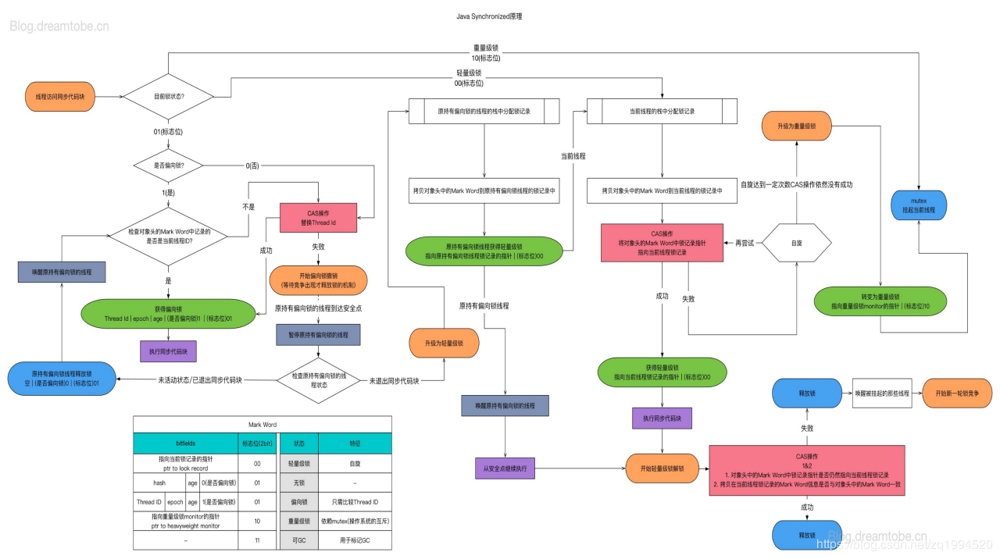

## Monitor

synchronized无论是代码块还是synchronized方法，其线程安全的语义实现最终依赖一个叫monitor的东西。  

在HotSpot虚拟机中，monitor是由ObjectMonitor实现的。其源码是用C++来实现的，位于HotSpot虚拟机源码ObjectMonitor.hpp文件中(src/share/vm/runtime/objectMonitor.cpp)。ObjectMonitor主要数据结构有这些。  

```c++
ObjectMonitor() {
    _header       = NULL;
    _count        = 0;
    _waiters      = 0,
    _recursions   = 0; //线程重入次数
    _object       = NULL; //存储该monitor的对象
    _owner        = NULL; //标示拥有该monitor的线程
    _WaitSet      = NULL; //处于wait状态的线程，会被加入到_WaitSet
    _WaitSetLock  = 0 ;
    _Responsible  = NULL ;
    _succ         = NULL ;
    _cxq          = NULL ; //多线程竞争锁时的单向列表
    FreeNext      = NULL ;
    _EntryList    = NULL ; //处于等待锁block状态的线程，会被加入到该列表
    _SpinFreq     = 0 ;
    _SpinClock    = 0 ;
    OwnerIsThread = 0 ;
    _previous_owner_tid = 0;
}
```

1、\_owner:初始时为NULL。当有线程占有该monitor时，owner标记为该线程的唯一标示。当线程释放monitor时，owner又恢复为NULL。owner是一个临界资源，JVM是通过CAS操作来保证其线程安全的。(CAS最终实现是依赖与不同平台的CPU指令集,，比如windows平台(src/os_cpu/windows_x86/vm/atomic_windows_x86.inline.hpp))

```c++
inline jint Atomic::cmpxchg (jint exchange_value, volatile jint* dest, jint compare_value) {
  // alternative for InterlockedCompareExchange
  int mp = os::is_MP();
  __asm {
    mov edx, dest
    mov ecx, exchange_value
    mov eax, compare_value
    LOCK_IF_MP(mp)
    cmpxchg dword ptr [edx], ecx
  }
}
```

2、\_cxq：竞争队列，所有请求锁的线程首先会被放在这个队列中(单向链接)，\_cxq是一个临界资源。JVM通过CAS原子指令来修改\_cxq队列。修改前\_cxq的旧值填入了node的next字段，\_cxq指向新值(新线程)。因此，\_cxq是一个后进先出的stack。  

3、\_EntryList: \_cxq队列中有资格成为候选资源的线程会被移动到该队列。  

4、\_WaitSet：因为调用wait方法而被阻塞的线程会被放在该队列中。  

每一个Java对象都可以与一个监视器monitor关联，我们可以把它理解成一把锁，当一个线程想要执行一段被synchronized圈起来的同步方法或者代码块时。该线程得先获取到synchronized修饰的对象对应的monitor。  

Java代码中不会显示地去创建这么一个monitor对象，我们也无需创建。   

monitor并不是随着对象创建而创建的。我们是通过synchronized修饰符告诉JVM需要为我们的某个对象创建关联的monitor对象。每个线程都存在两个ObjectMonitor对象列表，分别为free和used列表。同时JVM中也维护着global locklist。当线程需要ObjectMonitor对象时，首先从线程自身的free表中申请，若存在则使用，若不存在则从global list中申请。 

> 关于global lock list https://www.ibm.com/developerworks/cn/java/j-rtj3/index.html

ObjectMonitor的数据结构中包含:\_owner,\_WaitSet,\_EntryList，它们之间的关系转换可以用下图表示：  

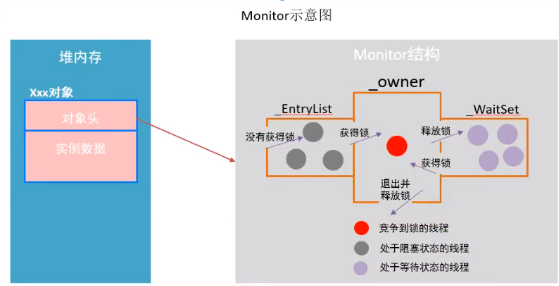  

待完善。。。。

## 锁种类

### 偏向锁

> 更细致的关于偏向锁：
>
> https://blog.csdn.net/zq1994520/article/details/83998117
>
> https://blog.csdn.net/zq1994520/article/details/84175573

偏向锁是JDK1.6中的重要引进，因为HotSpot作者经过研究时间发现，在大多数情况下，锁不仅不存在多线程竞争，而且总是由同一线程多次获得，为了让线程获得锁的代价更低，引进了偏向锁。  

该锁会偏向于第一个获得该锁的线程，会在对象头存储锁的偏向线程ID，以后该线程进入和退出同步代码块时只需要检查是否为偏向锁、锁标志位以及ThreadID即可。 

不过一旦出现多个线程竞争时，必须撤销偏向锁，所以撤销偏向锁消耗的性能必须小于之前节省下来的CAS原子操作的性能消耗，不然就得不偿失了。  

#### 偏向锁原理 

当线程第一次访问同步块并获取偏向锁时，偏向锁处理流程如下：  

1. 检测Mark Word是否为可偏向状态，即是否为偏向锁标志位为1，锁标识位为01.
2. 若为可偏向状态，则测试线程ID是否为当前线程ID，如果是，执行同步代码块，否则执行步骤3。
3. 如果测试线程ID不为当前线程ID，则通过CAS操作将Mark Word的线程ID替换为当前线程ID，执行同步代码块

#### 偏向锁的撤销

1. 偏向锁的撤销动作必须等待全局安全点
2. 暂停拥有偏向锁的线程，判断锁对象是否处于锁定状态
3. 撤销偏向锁，恢复到无锁(标志位为01，是否为偏向锁标志位为0)，或轻量级锁(标志位为00)的状态。

>偏向锁在java 1.6之后是默认启用的，但在应用程序启动的几秒种(默认是4000)之后才激活，可以使用
-XX:BiasedLockingStartupDelay=0 参数关闭，如果确定应用程序中所有锁通常情况下处于
竞争状态，可以通过-XX:-UseBiasedLocking = false 参数关闭偏向锁

#### 偏向锁的好处

偏向锁是只有在一个线程执行同步块时进一步提高性能，适用于一个线程反复获得同一把锁的情况。偏向锁可以提高带有同步但无竞争的程序性能。  

它同样是一个带有效益权衡性质的优化，也就是说，它并一定总是对程序运行有利，如果程序中大多数的锁总是被多个不同的线程访问比如线程池，那偏向模式就是多余的。  

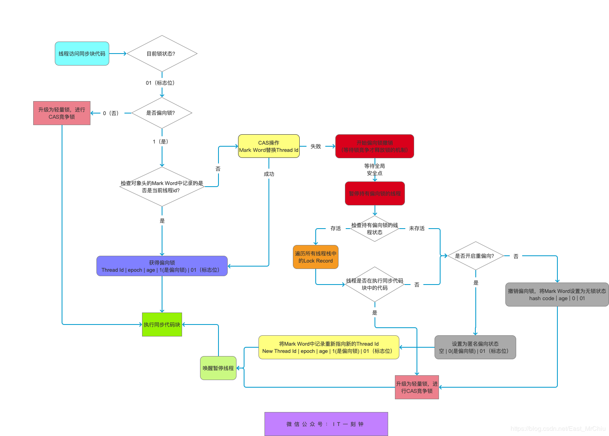  

#### 批量重偏向

待补充

#### 批量撤销

待补充

### 轻量级锁

轻量级锁时JDK1.6之中加入的新型锁机制，它名字中的“轻量级”是相对于使用monitor的传统锁而言的，因此传统的锁机制就称为“重量级”锁。首先需要强调一点的是，轻量级锁并不是用来代替重量级锁的。  

引入轻量级锁的目的：在多线程交替执行同步代码块的情况下，尽量避免重量级锁引起的性能消耗，但是如果多个线程在同一时刻进入临界区，会导致轻量级锁膨胀升级成重量级锁，所以轻量级锁的出现并非是要替代重量级锁。

#### 轻量级锁原理

当关闭偏向锁功能或者多个线程竞争偏向锁导致偏向锁升级为轻量级锁，则会尝试获取轻量级锁，其步骤如下：  

1、判断当前对象是否处于无锁状态(hashcode、0、01)，如果是，则JVM首先将在当前线程的栈帧中建立一个名为锁记录(Lock Record)的空间，用于存储锁对象目前Mark Word的拷贝(官方把这份拷贝加了一个Displaced前缀，即Displaced Mark Word)，将对象的Mark Word复制到栈帧中的Lock Record中，将Lock Record中的owner指向当前对象。  

2、JVM利用CAS操作尝试将对象的Mark Word更新为指向Lock Record的指针，如果成功表示竞争到锁，则将锁标志位变成00，执行同步操作。  

3、如果失败则判断当前对象的Mark Word是否指向当前线程的栈帧，如果是则表示当前线程已持有当前对象的锁，则直接执行同步代码块；否则只能说明该锁对象已经被其他线程抢占了，这时轻量级锁需要膨胀为重量级锁，锁标志位变成10，后面等待的线程将会进入阻塞状态

#### 轻量级锁的释放

轻量级锁的释放也是通过CAS操作来进行的，主要步骤如下：  

1、取出在获取轻量级锁保存在Displaced Mark Word中的数据。

2、用CAS操作将取出的数据替换当前对象的Mark Word中，如果成功则说明释放锁成功。  

3、如果CAS操作替换失败，说明有其他线程尝试获取该锁，则需要将轻量级锁膨胀为重量级锁  

对于轻量级锁，其性能提升的依据是“对于绝大部分的锁，在整个生命周期内都是不会存在竞争的”，如果打破这个依据，则除了互斥的开销外，还有额外的CAS操作，因此在有多线程竞争的情况下，轻量级锁比重量级锁更慢  

#### 轻量级锁的好处

在多线程交替执行同步块的情况下，可以避免重量级锁引起的性能消耗。  

### 自旋锁

前面我们讨论monitor实现锁的时候，知道monitor会阻塞和唤醒线程，线程的阻塞和唤醒需要CPU从用户态转为内核态，频繁的阻塞和唤醒对CPU来说是一件负担很重的工作，这些操作给系统的并发性能带来了很大的压力。同时，虚拟机的开发团队也注意到在许多应用上，共享数据的锁定状态只会持续很短的一段时间，为了这段时间阻塞和唤醒线程并不值得。如果物理机有一个以上的处理器，能让两个或以上的线程同时并行执行，我们就可以让后面请求锁的那个线程“稍等一下”，但不放弃处理器的执行时间，看看持有锁的线程是否很快就会释放锁。为了让线程等待，我们只需让线程执行一个忙循环(自旋)，这项技术就是所谓的自旋锁。  

自旋锁在JDK1.4.2中就已经引入了，只不过默认是关闭的，可以使用-XX:UseSpinning参数来开启，在JDK6中就已经改为默认开启了。自旋等待不能代替阻塞，且先不说对处理数量的要求，自旋等待本身虽然避免了线程切换的开销，但它是要占用处理器时间的，因此，如果锁被占用的时间很短，自旋等待的效果就会非常好，反之，如果锁被占用的时间很长。那么自旋的线程只会白白消耗处理器资源，而不会做任何有用的工作，反而会带来性能上的浪费。因此，自旋等待时间必须要有一定的限度，如果自旋超过了限定次数仍然没有成功获得锁，就应当使用传统的方式去挂起线程了。自旋次数的默认值是10次，用户可以使用参数`-XX:PreBlockSpin`来更改。  

#### 适应性自旋锁

在JDK6中引入了自适应的自旋锁。自适应意味着自旋的时间不再固定了，而是由前一次在同一个锁上的自旋时间及锁的拥有者的状态来决定。如果在同一个锁对象上，自旋等待刚刚成功获得过锁，并且持有锁的线程正在运行中，那么虚拟机就会认为这次自旋也很有可能再次成功，进而它将允许自旋等待持续相对更长的时间，比如100次循环。另外，如果对于某个锁，自旋很少成功获得过，那在以后要获取这个锁时将很可能省略掉自旋过程，以避免浪费处理器资源。有了自适应自旋，随着程序运行和性能监控信息的不断完善，虚拟机对程序锁的状况预测就会越来越准确，虚拟机就会变得越来越“聪明”。  


## 锁转化

高效并发是从JDK1.5到JDK1.6的一个重要改进，提供了各种锁优化技术，包括偏向锁(Biased Locking)、轻量级锁(LightWeight Locking)、适应性自旋(Adaptive Spinning)、锁消除(Lock Elimination)、锁粗化(Lock Coaesening)等。  

无锁 -> 偏向锁 -> 轻量级锁 -> 重量级锁

### Java对象布局

对象在内存中的布局分为三块区域：对象头，实例数据和对齐填充(**当前两部分对齐了8的倍数时，则无需填充**，所以对齐填充的数据区域不一定是必须存在的)。  

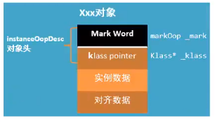  

```c++
class oopDesc {
  friend class VMStructs;
 private:
  volatile markOop  _mark;
  union _metadata {
    //未开启指针压缩的指针
    Klass*      _klass;
    //开启了指针压缩的指针
    narrowKlass _compressed_klass;
  } _metadata;
    
  // Fast access to barrier set.  Must be initialized.
  static BarrierSet* _bs;
  ...
}
```

在普通实例对象中，oopDesc的定义包含两个成员，分别是`_mark `和`_metadata`  

`_mark`表示对象标记、属于markOop类型，也就是常说的Mark word，它记录了和锁有关的信息。  

`_metadata`表示类的元信息，类的元信息存储的是对象指向它的类元数据(Klass)的首地址，其中`_Klass`表示普通指针，`_compressed_klass`表示压缩类指针。  

对象头由两部分组成，一部分用于存储自身的运行时数据，称之为Mark Word，另一部分是类型指针，及对象指向它的类元数据的指针。  

#### Mark Word

Mark Word用于存储对象自身的运行时数据，如HashCode、GC分代年龄、锁状态标志、线程持有的锁、锁偏向线程ID、偏向时间戳等等，**占用内存大小与虚拟机位长一致(32位虚拟机则Mark Word占对象头32位，64位虚拟机则占用64位)**，Mark Word对应的类型是markOop。  

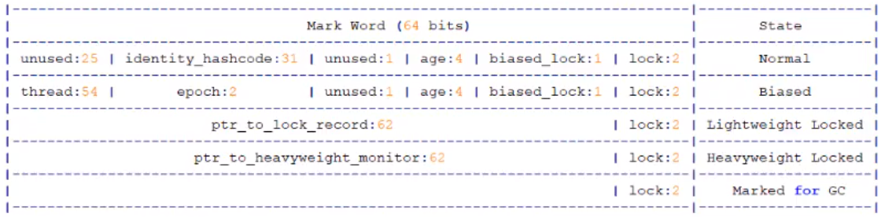  

64位虚拟机：    

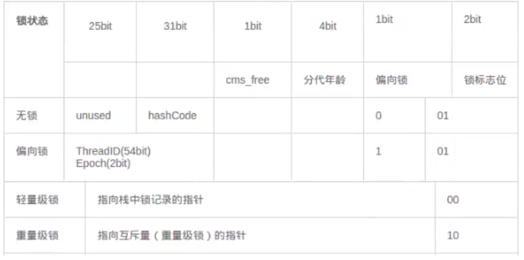  

锁状态官方解释：  

```c++
//  - the two lock bits are used to describe three states: locked/unlocked and monitor.
//
//[ptr          | 00]  locked       ptr points to real header on stack
//[header   | 0 | 01]  unlocked     regular object header
//[ptr          | 10]  monitor      inflated lock (header is wapped out)
//[ptr          | 11]  marked       used by markSweep to mark an object
//                                  not valid at any other time
```

#### klass pointer

这一部分用于存储对象的类型指针，该指针指向它的类元数据，JVM通过这个指针确定对象是哪个类的实例。该指针的位长度为JVM的一个字(Word)大小，即32位虚拟机为32位，64位虚拟机为64位。  

如果应用的对象过多，使用64位的指针将浪费大量内存，统计而言，64位的JVM将会比32位的JVM多耗费50%内存。为了节约内存可以使用选项`-XX:UseCompressedOops`开启指针压缩。  其中，oop即(ordinary object pointer)普通对象指针。开启该选项后，下列指针将压缩至32位：  

1. 每个Class的属性指针(即静态变量)
2. 每个对象的属性指针(即对象变量)
3. 普通对象数组的每个元素指针

当然，也不是所有的指针都会压缩，一些特殊类型的指针JVM不会优化，比如指向PermGen的Class对象指针(JDK8中指向元空间的Class对象指针)、本地变量、堆栈元素、入参、返回值和NULL指针等。  

> 注意：在64位虚拟机此选项默认是开启的
>
> 使用 java -XX:+PrintFlagsFinal -version可以查看默认
>
> bool UseCompressedOops                        := true                                {lp64_product}

在32位系统中，Mark Word = 4bytes，类型指针 = 4bytes，对象头 = 8 byte = 64bit  

在64位系统中，Mark Word = 8bytes，类型指针 = 8bytes，对象头 = 16bytes = 128bit  

#### 实例数据

就是类中定义的成员变量

#### 对齐填充

对齐填充并不是必然存在，也没有什么特别的意义，他仅仅起着占位符的作用，用于HotSpot VM的自动内存管理系统要求对象起始地址必须是8字节的整数倍，换句话说，就是对象的大小必须是8字节的整数倍。而对象头正好是8字节的倍数，因此，当对象实例数据部分没有对齐时，就需要通过对齐填充来补全。  

### 锁消除

锁消除是指虚拟机即时编译器(JIT)在运行时，对一些代码上要求同步，但是被检测到不可能存在共享数据竞争的锁进行消除。锁消除的主要判定依据来源于逃逸分析的数据支持，如果判断在一段代码中，堆上的所有数据都不会逃逸出去从而被其他线程访问到，那就可以把它们当做栈上数据对待，认为它们是线程私有的，同步加锁自然就无需进行。变量是否逃逸，对于虚拟机来说需要使用数据流分析来确定。

```java
public class Lockerasing {
    public static String ccString(String s1, String s2, String s3) {
        return new StringBuffer().append(s1).append(s2).append(s3).toString();
    }
    public static void main(String[] args) {
        ccString("aa","bb","cc");
    }
}
```

StringBuffer的append()是一个同步方法，锁就是this也就是(new StringBuffer())。虚拟机发现它的动态作用域被限制在ccString()方法内部。也就是说，new StringBuffer()对象的引用永远不会“逃逸”到ccString()方法之外，其他线程无法访问到它，因此，虽然这里有锁，但是可以被安全地消除掉，在即时编译之后，这段代码就会忽略掉所有的同步而直接执行了。  

### 锁粗化

在我们编写代码的时候，总是推荐将同步代码块的作用范围限制的尽量小，只在共享数据的实际作用域中才进行同步，这样是为了使得需要同步的操作数量尽可能变小，如果存在锁竞争，那等待锁的线程也能尽快拿到锁。大部分情况下，上面的原则都是正确的，但是如果一系列的连续操作都对同一个对象反复加锁和解锁，甚至加锁操作室出现在循环体中的，那即使没有线程竞争，频繁地进行互斥同步操作也会导致不必要的性能损耗。  

如果虚拟机探测到有这样一串零碎小的操作都使用一个对象锁，将会把加锁同步的范围扩展(粗化)到整个操作序列外面，这样只需加一次锁即可


