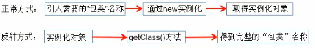

# Java8 新特性

## 函数式接口(jdk-1.8开始提供)

四大函数式接口：

  

## ForkJoinPool....

分支合并框架。  

ForkJoinPool, ForkJoinTask, RecursiveTask  


把大任务分解成小任务，来并行执行(fork)，计算完后再合并起来(join)


## 异步回调

**CompletableFuture**  

可以实现无返回调用，也可以实现有返回调用  

  

# HashMap

## 类继承结构


## 底层数组存储结构

  

## Integer.highestOneBit(i)

获得i这个数二进制形式最左边的最高位为1，其他位补零的数。实际效果就是，返回给定数字的向下最接近2次幂的数字。例如9，向下最接近2次幂的数就为8。  

https://blog.csdn.net/jessenpan/article/details/9617749

## JDK1.7 roundUpToPowerOf2(i) ----- JDK 1.8 tableSizeFor(i)

```java
//1.8
static final int tableSizeFor(int cap) {
    int n = cap - 1;
    n |= n >>> 1;
    n |= n >>> 2;
    n |= n >>> 4;
    n |= n >>> 8;
    n |= n >>> 16;
    return (n < 0) ? 1 : (n >= MAXIMUM_CAPACITY) ? MAXIMUM_CAPACITY : n + 1;
}
```

  

获得给定数字向上最靠近2次幂的数字，例如9，那么获得的就是16这个数字。**减一是考虑了当给定的数字就是2次幂的情况**  

## 为什么数组长度要为2次幂

1、方便用与运算来替代取模操作

```java
//1.8
if ((p = tab[i = (n - 1) & hash]) == null)
//1.7用的是indexFor方法，内容是一样的
```

> 例如数组长度为16，hashcode为0101 1010，得到数组下标的运算为 hashcode & (length - 1)
>
> 那么  length - 1 = 0000 1111
>
> ​         hashcode = 0101 1010
>
> 做一次与运算得到 0000 1010，正好是取模的值，由此也可以看出，长度-1之后，位为1的区段就是数组的取值范围

## 为什么获得hashcode之后，高16位要与低16位进行与运算

```java
//1.8
static final int hash(Object key) {
    int h;
    return (key == null) ? 0 : (h = key.hashCode()) ^ (h >>> 16);
}
```

因为，与运算，两个位只要有一位变化，结果也会发生变化。这样让高位也参与运算，提高散列性。  

同时由于，刚开始hashmap的数组长度很小，在进行与运算的时候，hashcode参与运算的位数基本在低16位当中，所以需要让高位也参与到计算当中

## JDK1.7与JDK1.8的扩容条件与时机不同

在1.7中，扩容有两个条件  

  

1、当前size大于阈值  

2、**当前所要放入的数组所在位置不为空**  

并且，插入元素之前先判断需不需要扩容

而1.8中，则是先插入元素再判断需不需要扩容

## JDK1.7与1.8新增元素的插入位置不同

1.7当中，是用头插法将hash冲突的元素插入到链表当中  

1.8当中，是用尾插发将hash冲突的元素插入到链表当中  

**1.8的Hashmap将头插法改成尾插法，目的是解决多线程环境下扩容时链表死循环的问题**

## JDK1.8中链表转为红黑树的条件

1、链表长度超过TREEIFY_THRESHOLD(默认是8)

2、哈希表中所有元素超过MIN_TREEIFY_CAPACITY(默认是64)

## Put方法

```java
final V putVal(int hash, K key, V value, boolean onlyIfAbsent, boolean evict) {
    //tab: 引用当前HashMapde 散列表
    //p: 表示当前的散列表元素
    //n: 表示散列表数组的长度
    //i: 表示路由寻址的结果(也就是数据要放入数组位置的下标)
    Node<K,V>[] tab; Node<K,V> p; int n, i;
    
    //延迟初始化逻辑，第一次调用putVal时会初始化HashMap对象中的最耗费内存的散列表
    if ((tab = table) == null || (n = tab.length) == 0)
        n = (tab = resize()).length;
    //如果找到的位置没有数据，则将当前KV封装成Node对象并放入数组当中
    if ((p = tab[i = (n - 1) & hash]) == null)
        tab[i] = newNode(hash, key, value, null);
    else {
        //e: 不为null的话，找到了一个与当前要插入的kv一致key的元素
        //k: 表示临时的一个key
        Node<K,V> e; K k;
        
        //表示位置中的该元素与你当前插入的元素的key完全一致，表示后续需要进行替换操作
        if (p.hash == hash &&
            ((k = p.key) == key || (key != null && key.equals(k))))
            e = p;
        //是否已经树化
        else if (p instanceof TreeNode)
            e = ((TreeNode<K,V>)p).putTreeVal(this, tab, hash, key, value);
        else {
            for (int binCount = 0; ; ++binCount) {
                //如果已经到了链表尾部也没找到一个与当前要插入的key一致的node，则将KV插入链表尾部
                if ((e = p.next) == null) {
                    p.next = newNode(hash, key, value, null);
                    //判断链表长度如果大于等于树化阈值，则将链表树化，-1是因为bincount是从0开始
                    if (binCount >= TREEIFY_THRESHOLD - 1) // -1 for 1st
                        //树化操作
                        treeifyBin(tab, hash);
                    break;
                }
                //找到了与当前需要插入kv的node
                if (e.hash == hash &&
                    ((k = e.key) == key || (key != null && key.equals(k))))
                    break;
                p = e;
            }
        }
        //e不等于null，条件成立说明找到了一个与当前插入元素key完全一致的数据，需要进行替换
        if (e != null) { // existing mapping for key
            V oldValue = e.value;
            if (!onlyIfAbsent || oldValue == null)
                e.value = value;
            afterNodeAccess(e);
            //返回旧值
            return oldValue;
        }
    }
    //表示散列表结构被修改次数，替换Node元素中的value不计数(也就是更新元素)
    ++modCount;
    //插入新元素，size自增，判断自增后的大小是否需要扩容
    if (++size > threshold)
        resize();
    afterNodeInsertion(evict);
    return null;
}
```

## resize方法-扩容

为什么需要扩容：为了解决哈希冲突导致的链化影响查询效率问题，扩容会缓解该问题。  

```java
final Node<K,V>[] resize() {
    //oldTab: 引用扩容前的哈希表
    Node<K,V>[] oldTab = table;
    //oldCap: 表示扩容之前table数组的长度
    int oldCap = (oldTab == null) ? 0 : oldTab.length;
    //oldThr: 表示扩容之前的扩容阈值，触发本次扩容的阈值
    int oldThr = threshold;
    //newCap: 扩容之后table数组的大小
    //newThr: 扩容之后再次触发扩容的条件
    int newCap, newThr = 0;
    //条件成立说明，HashMap中的散列数组已经初始化过了，是一次正常的扩容
    if (oldCap > 0) {
        //如果当前长度大于等于最大长度，则设置长度为上限，并直接返回旧table，表示无法再扩容
        if (oldCap >= MAXIMUM_CAPACITY) {
            threshold = Integer.MAX_VALUE;
            return oldTab;
        }
        //正常扩容，oldCap左移一位实现翻倍，并且赋值给newCap，newCap小于数组最大值限制 且 扩容之前阈值>=16
        //这种情况下，下一次扩容阈值等于当前阈值翻倍
        else if ((newCap = oldCap << 1) < MAXIMUM_CAPACITY &&
                 oldCap >= DEFAULT_INITIAL_CAPACITY)
            newThr = oldThr << 1; // double threshold
    }
    //oldCap == 0，说明HashMap中的散列表是null，在以下几种情况，oldThr会不为0
    //1.new HashMap(initCap, loadFactor)
    //2.new HashMap(initCap)
    //3.new HashMap(map)，并且这个Map有数据
    else if (oldThr > 0) // initial capacity was placed in threshold
        newCap = oldThr;
    //oldCap = 0, oldThr = 0
    //只会在调用new HashMap()的时候走到
    else {               // zero initial threshold signifies using defaults
        newCap = DEFAULT_INITIAL_CAPACITY; //16
        newThr = (int)(DEFAULT_LOAD_FACTOR * DEFAULT_INITIAL_CAPACITY);  //12
    }
    //newThr为0时，通过newCap和loadFactor计算出一个newThr
    if (newThr == 0) {
        float ft = (float)newCap * loadFactor;
        newThr = (newCap < MAXIMUM_CAPACITY && ft < (float)MAXIMUM_CAPACITY ?
                  (int)ft : Integer.MAX_VALUE);
    }
    threshold = newThr;
    @SuppressWarnings({"rawtypes","unchecked"})
    Node<K,V>[] newTab = (Node<K,V>[])new Node[newCap];
    table = newTab;
    //说明，HashMap本次扩容之前数组已经创建
    if (oldTab != null) {
        
        for (int j = 0; j < oldCap; ++j) {
            //当前Node节点
            Node<K,V> e;
            //成立，表示数组当前位置有数据
            if ((e = oldTab[j]) != null) {
                //方便JVM GC时回收内存
                oldTab[j] = null;
                //第一种情况: 表示此处未产生hash碰撞，直接将元素重新计算位置即可
                if (e.next == null)
                    newTab[e.hash & (newCap - 1)] = e;
                //第二种情况: 当前节点已经树化
                else if (e instanceof TreeNode)
                    ((TreeNode<K,V>)e).split(this, newTab, j, oldCap);
                else { // preserve order
                    //第三种情况，当前位置已经形成链表
                    //低位链表: 存放在扩容之后的数组的下标位置，与当前数组的下标位置一致
                    Node<K,V> loHead = null, loTail = null;
                    //高位链表: 存放在扩容之后的数组的下标位置为 当前数组下标位置 + 扩容之前的数组长度
                    Node<K,V> hiHead = null, hiTail = null;
                    Node<K,V> next;
                    //将链表中的元素拆分成低位链表与高位链表
                    do {
                        next = e.next; 
                        if ((e.hash & oldCap) == 0) {
                            if (loTail == null)
                                loHead = e;	
                            else
                                loTail.next = e;
                            loTail = e;
                        }
                        else {
                            if (hiTail == null)
                                hiHead = e;
                            else
                                hiTail.next = e;
                            hiTail = e;
                        }
                    } while ((e = next) != null);
                    if (loTail != null) {
                        //这里的next可能会指向旧值，由于低位链表已到了末尾，直接赋null即可
                        loTail.next = null;
                        newTab[j] = loHead;
                    }
                    if (hiTail != null) {
                        hiTail.next = null;
                        newTab[j + oldCap] = hiHead;
                    }
                }
            }
        }
    }
    return newTab;
}
```

## get方法

```java
final Node<K,V> getNode(int hash, Object key) {
    //tab: 引用当前HashMap的散列表
    //first: 桶位中的头元素
    //e: 临时node元素
    //n: table数组长度
    Node<K,V>[] tab; Node<K,V> first, e; int n; K k;
    
    if ((tab = table) != null && (n = tab.length) > 0 &&
        (first = tab[(n - 1) & hash]) != null) {
        if (first.hash == hash && // always check first node
            ((k = first.key) == key || (key != null && key.equals(k))))
            return first;
        if ((e = first.next) != null) {
            if (first instanceof TreeNode)
                return ((TreeNode<K,V>)first).getTreeNode(hash, key);
            do {
                if (e.hash == hash &&
                    ((k = e.key) == key || (key != null && key.equals(k))))
                    return e;
            } while ((e = e.next) != null);
        }
    }
    return null;
}
```

## remove方法

```java
public V remove(Object key) {
    Node<K,V> e;
    return (e = removeNode(hash(key), key, null, false, true)) == null ?
        null : e.value;
}
```

```java
final Node<K,V> removeNode(int hash, Object key, Object value,
                           boolean matchValue, boolean movable) {
    //tab: 引用当前HashMap中的散列表
    //p: 当前Node元素
    //n: 表示散列表长度
    //index: 表示寻址结果
    Node<K,V>[] tab; Node<K,V> p; int n, index;
    //判断散列表是否存在，位置是否为空
    if ((tab = table) != null && (n = tab.length) > 0 &&
        (p = tab[index = (n - 1) & hash]) != null) {
        //进入if说明桶位是有数据的，需要进行查找操作，并且删除
        //node: 查找到的结果
        //e: 当前node的下一个元素
        Node<K,V> node = null, e; K k; V v;
        if (p.hash == hash &&
            ((k = p.key) == key || (key != null && key.equals(k))))
            node = p;
        else if ((e = p.next) != null) {
            //到这个分支说明当前桶位要么是链表，要么是红黑树
            if (p instanceof TreeNode)
                node = ((TreeNode<K,V>)p).getTreeNode(hash, key);
            else {
                do {
                    if (e.hash == hash &&
                        ((k = e.key) == key ||
                         (key != null && key.equals(k)))) {
                        node = e;
                        break;
                    }
                    p = e;
                } while ((e = e.next) != null);
            }
        }
        //判断node不为空表示根据key查找到了需要删除的数据
        if (node != null && (!matchValue || (v = node.value) == value ||
                             (value != null && value.equals(v)))) {
            if (node instanceof TreeNode)
                ((TreeNode<K,V>)node).removeTreeNode(this, tab, movable);
            else if (node == p)
                tab[index] = node.next;
            else
                p.next = node.next;
            ++modCount;
            --size;
            afterNodeRemoval(node);
            return node;
        }
    }
    return null;
}
```

## replace方法

内部使用的就是get方法所调用的getNode方法


# Java 集合接口


# 标记型接口

## Serializable

## Cloneable

## RandomAccess

此接口以表示实现类支持快速(通常为恒定时间)随机访问。  

此接口的主要目的是允许通用算法更改其行为，以便于在应用于随机访问列表或顺序访问列表时提供良好的性能。

所以，实现了该接口之后，该集合的随机访问效率是要高于顺序访问的。

### 随机访问

```java
for(int i = 0;i < list.size();i++) list.get(i);
```

### 顺序访问

```java
for(Iterator i = list.iterator(); i.hasNext();) i.next()
```

### 开发经验

当接收到一个List的子类对象的时候，可以判断子类是否有实现RandomAccess接口，通过以上判断来采取不同的遍历方式。(主要针对ArrayList与LinkedList)，如果实现：推荐使用随机访问的方式进行遍历；否则，使用顺序访问遍历  

# IO

## NIO

Java NIO(Non-Blocking IO) 是从Java1.4版本开始引入的一套新的IO API，可以替代标准的Java IO API。NIO与原来的IO有同样的作用和目的，但是使用的方式完全不同，NIO支持面向缓冲区的(IO是面向流的)、基于通道的IO操作。NIO将以更高效的方式进行文件的读写操作  

Java API中提供了两套NIO，一套是针对标准输入输出NIO，另一套就是网络编程NIO  

java.nio.channels.Channel  
  FileChannel:处理本地文件  
  SocketChannel:TCP网络编程的客户端Channel  
  ServerSocketChannel:TCP网络编程的服务器端的Channel  
  DatagramChannel:UDP网络编程中发送端和接收端的Channel  


Java NIO系统的核心在于：通道(Channel)和缓冲区(Buffer)。通道便是打开到IO设备(例如文件，套接字)的链接。若需要使用NIO系统，需要获取用于连接IO设备的通道以及用于容纳数据的缓冲区。然后操作缓冲区，对数据进行处理。  

**简而言之，Channel负责传输，Buffer负责存储**  

### Channel
Channel表示IO源与目标打开的连接。Channel类似与传统的"流"。只不过Channel本身不能直接访问数据，Channel只能与Buffer进行交互。  

早期  

  

改进  

 

> DMA(Direct Memory Access，直接存储器访问) 是所有现代电脑的重要特色，它允许不同速度的硬件装置来沟通，而不需要依赖于 CPU 的大量中断负载。否则，CPU 需要从来源把每一片段的资料复制到暂存器，然后把它们再次写回到新的地方。在这个时间中，CPU 对于其他的工作来说就无法使用。
>
> DMA 传输将数据从一个地址空间复制到另外一个地址空间。当CPU 初始化这个传输动作，传输动作本身是由 DMA 控制器来实行和完成。典型的例子就是移动一个外部内存的区块到芯片内部更快的内存区。像是这样的操作并没有让处理器工作拖延，反而可以被重新排程去处理其他的工作。DMA 传输对于高效能 嵌入式系统算法和网络是很重要的。
>
>   
>
> 在实现DMA传输时，是由DMA控制器直接掌管总线，因此，存在着一个总线控制权转移问题。即DMA传输前，CPU要把总线控制权交给DMA控制器，而在结束DMA传输后，DMA控制器应立即把总线控制权再交回给CPU。一个完整的DMA传输过程必须经过DMA请求、DMA响应、DMA传输、DMA结束4个步骤

通道  

  

 由于DMA也是要向CPU去获取总线控制权的，当大量的IO请求进来时，CPU的利用率也会下降，因为要处理来自DMA的总线控制权的请求。  

而通道不需要向CPU请求，所以相对于DMA操作性能要高一些

#### 获取

获取通道的三种方式：  

1、Java针对支持通道的类提供了getChannel()方法  

  本地IO: FileInputStream/FileOutputStream, RandomAccessFile  

  网络IO: Socket, ServerSocket, DatagramSocket  

2、在JDK1.7中的NIO.2针对各个通道提供了静态方法open()  

3、在JDK1.7中的NIO.2的Files工具类的newByteChannel()  

#### 通道间的数据传输

也是通过直接缓冲区的方式  

transferTo()  

transferFrom()  

#### 分散读取与聚集写入

分散读取(Scattering Read) :   将通道中的数据分散到多个缓冲区中  

聚集写入(Gathering Writes) : 将多个缓冲区中的数据聚集到通道中

### 缓冲区

一个用于特定基本数据类型的容器。有java.nio包定义的，所有缓冲区都是Buffer抽象类的子类  

NIO中的Buffer主要用于与NIO通道进行交互，数据是从通道读入缓冲区，从缓冲区写入通道中的。  

#### 直接缓冲区

  

通过allocateDirect()方法分配直接缓冲区，将缓冲区建立在本地内存中，可以提高效率。  

如果分配直接字节缓冲区，则Java虚拟机会尽最大努力直接在此缓冲区上执行本机I/O操作。也就是说，在每次调用基础操作系统的一个本机I/O操作之前(或之后)，虚拟机都会尽量避免将缓冲区的内容复制到中间缓冲区中(或从中间缓冲区中复制内容)  

直接字节缓冲区可以通过调用allocateDirect()工厂方法来创建。此方法返回的**缓冲区进行分配和取消分配所需成本通常高于非直接缓冲区**。直接缓冲区的内容可以驻留在常规的垃圾回收堆之外。因此，它们对应用程序的内存需求量造成的影响可能并不明显。所以，建议将直接缓冲区主要分配给那些易受基础系统的本机I/O操作影响的大型、持久的缓冲区。一般情况下，最好仅在直接缓冲区能在程序性能方面带来明显好处时分配它们。  

直接字节缓冲区还可以通过**FileChannel的map()方法**，将文件区域直接映射到内存中来创建。该方法返回**MappedByteByteBuffer**。Java平台的实现有助于通过JNI从本机代码创建直接字节缓冲区。如果以上这些缓冲区中的某个缓冲区实例指的是不可访问的内存区域，则试图访问该区域时不会更改该缓冲区的内容，并且将会在某个访问期间内或稍后的某个时间导致抛出不确定的异常。  

字节缓冲区是直接缓冲区还是非直接缓冲区可通过调用isDirect()方法来确定

#### 非直接缓冲区

通过allocate()方法分配缓冲区，将缓冲区建立在JVM的堆内存中。  

  


### 网络通信

#### 阻塞与非阻塞

传统的 IO 流都是阻塞式的。也就是说，当一个线程调用 read() 或 write() 时，该线程被阻塞，直到有一些数据被读取或写入，该线程在此期间不 能执行其他任务。因此，在完成网络通信进行 IO 操作时，由于线程会 阻塞，所以服务器端必须为每个客户端都提供一个独立的线程进行处理， 当服务器端需要处理大量客户端时，性能急剧下降。  

Java NIO 是非阻塞模式的。当线程从某通道进行读写数据时，若没有数 据可用时，该线程可以进行其他任务。线程通常将非阻塞 IO 的空闲时 间用于在其他通道上执行 IO 操作，所以单独的线程可以管理多个输入 和输出通道。因此，NIO 可以让服务器端使用一个或有限几个线程来同 时处理连接到服务器端的所有客户端。  

### 选择器

选择器（Selector） 是 SelectableChannle 对象的多路复用器，Selector 可 以同时监控多个 SelectableChannel 的 IO 状况，也就是说，利用 Selector 可使一个单独的线程管理多个 Channel。Selector 是非阻塞 IO 的核心。

SelectableChannel结构如下：  

  

> 当调用 register(Selector sel, int ops)  将通道注册选择器时，选择器 对通道的监听事件，需要通过第二个参数 ops 指定。  
> 可以监听的事件类型（可使用 SelectionKey 的四个常量表示）：  
> 读 : SelectionKey.OP_READ  （1）  
> 写 : SelectionKey.OP_WRITE    （4）  
> 连接 : SelectionKey.OP_CONNECT （8）  
> 接收 : SelectionKey.OP_ACCEPT  （16）  
>
> 若注册时不止监听一个事件，则可以使用“位或”操作符连接。  
>
>   


  

  


### 区别

| IO                      | NIO                         |
| ----------------------- | --------------------------- |
| 面向流(Stream oriented) | 面向缓冲区(Buffer Oriented) |
| 阻塞IO(Blocking IO)     | 非阻塞IO(Non Blocking IO)   |
| (无)                    | 选择器(Selectors)           |

## IO多路复用

### select

select是一个阻塞函数，直到有fd有数据，会将有数据fd在bitmap中的位为1，之后返回，其实就是在轮询判断，只不过将轮询的动作交到了内核态执行，这样减少了上下文的切换(用户直接轮询FD，其实也就是在询问内核FD是否准备就绪，这样涉及到了用户态和内核态的切换，效率不高)

  

select工作流程：

将需要判断的文件FD(文件描述符File Description)收集起来，并交给内核来进行轮询判断哪一个FD有数据，当有一个FD或多个FD有数据时，select函数会返回，并且有数据的FD会被置位。之后用户再自己遍历FD的集合，找到被置位的FD，进行相应的操作

#### 缺点

1、默认指示FD的bitmap大小是1024

2、fd_set每次循环都要重新创建，不可重用

3、虽然rset从用户态拷贝到了内核态，但是仍然需要进行两次用户态和内核态的切换

4、不能明确知道哪一个FD被置位，需要一次遍历FD集合，O(n)

### poll

  

events表示关心哪个事件：读， pollin事件 ；写，pollout事件，都在意，两者或运算一下就可以  

当有FD有数据的时候pollfd中的revents会被置位，接下来只要判断revents是否是POLLIN，如果是则进行数据的相关操作，并将revents置回0  

#### 解决问题

解决了select的FD的bitmap长度限制为1024的问题  

解决了FD_SET不能重用的问题  

### epoll

  

**epoll_create** : 该函数生成一个epoll专用的文件描述符。它其实是在内核申请一空间，用来存放你想关注的socket fd上是否发生以及发生了什么事件。size就是你在这个epoll fd上能关注的最大socket fd数。随你定好了。只要你有空间。可参见上面与select之不同  

> 创建一个epoll的句柄，size用来告诉内核这个监听的数目一共有多大。这个参数不同于select()中的第一个参数，给出最大监听的fd+1的值。需要注意的是，当创建好epoll句柄后，它就是会占用一个fd值，在linux下如果查看/proc/进程id/fd/，是能够看到这个fd的，所以在使用完epoll后，必须调用close()关闭，否则可能导致fd被耗尽  

**epoll_ctl** : epoll的事件注册函数，它不同与select()是在监听事件时告诉内核要监听什么类型的事件，而是在这里先注册要监听的事件类型。  

> 函数声明：int epoll_ctl(int epfd, int op, int fd, struct epoll_event \*event)
> 该函数用于控制某个epoll文件描述符上的事件，可以注册事件，修改事件，删除事件。
> 参数：
> epfd：由 epoll_create 生成的epoll专用的文件描述符；
> op：要进行的操作例如注册事件，可能的取值EPOLL_CTL_ADD 注册、EPOLL_CTL_MOD 修 改、EPOLL_CTL_DEL 删除
> fd：关联的文件描述符；
> event：指向epoll_event的指针；
> 如果调用成功返回0,不成功返回-1
>
> 或者这个解释：
> 第一个参数是epoll_create()的返回值，
> 第二个参数表示动作，用三个宏来表示：
> EPOLL_CTL_ADD：       注册新的fd到epfd中；
> EPOLL_CTL_MOD：      修改已经注册的fd的监听事件；
> EPOLL_CTL_DEL：        从epfd中删除一个fd；
> 第三个参数是需要监听的fd，
> 第四个参数是告诉内核需要监听什么事件
>
> events可以是以下几个宏的集合：
>        EPOLLIN：            触发该事件，表示对应的文件描述符上有可读数据。(包括对端SOCKET正常关闭)；
>        EPOLLOUT：         触发该事件，表示对应的文件描述符上可以写数据；
>        EPOLLPRI：           表示对应的文件描述符有紧急的数据可读（这里应该表示有带外数据到来）；
>        EPOLLERR：        表示对应的文件描述符发生错误；
>        EPOLLHUP：        表示对应的文件描述符被挂断；
>        EPOLLET：           将EPOLL设为边缘触发(Edge Triggered)模式，这是相对于水平触发(Level Triggered)来说的。
>        EPOLLONESHOT：  只监听一次事件，当监听完这次事件之后，如果还需要继续监听这个socket的话，需要再次把这个socket加入到EPOLL队列里。

**epoll_wait(int epfd, struct epoll_event * events, intmaxevents, int timeout)**

该函数用于轮询I/O事件的发生；

> 参数：
> epfd:由epoll_create 生成的epoll专用的文件描述符；
> epoll_event:用于回传待处理事件的数组；
> maxevents:每次能处理的事件数；
> timeout:等待I/O事件发生的超时值(单位我也不太清楚)；-1相当于阻塞，0相当于非阻塞。一般用-1即可
> 返回发生事件数。
>
> 参数events用来从内核得到事件的集合，maxevents告之内核这个events有多大(数组成员的个数)，这个maxevents的值不能大于创建epoll_create()时的size，参数timeout是超时时间（毫秒，0会立即返回，-1将不确定，也有说法说是永久阻塞）。

epoll会把有数据的FD放到epoll_event当中，之后返回触发事件的个数

epoll解决了用户态到内核态的开销，因为epfd所使用的内存是内核态与用户态共享的  

也解决了寻找有数据的FD需要遍历所有FD的问题。

# 反射

Reflection(反射)是被视为动态语言的关键，反射机制允许程序在执行期借助于Reflection API取得任何类的内部信息，并能直接操作任意对象的内部属性及方法。  

加载完类之后，在堆内存的方法区中就产生了一个Class类型的对象(一个类只有一个Class对象)，这个对象就包含了完整的类的结构信息。我们可以通过这个对象看到类的结构。这个对象就像一面镜子，透过这个镜子看到类的结构，所以，我们形象的称之为：**反射**  

  

> 动态语言：
>
> 是一类在运行时可以改变其结构的语言：例如新的函数、对象、甚至代码可以被引进，已有的函数可以被删除或者是其他结构上的变化。通俗点说就是在运行时代码可以根据某些条件改变自身结构
>
> 主要动态语言：Object-C, C#, JavaScript, PHP, Python, Erlang
>
> 静态语言：
>
> 与动态语言相对对应，运行时结构不变的语言就是静态语言。如Java、C、C++
>
> Java不是动态语言，但Java可以称之为“准动态语言”，即Java有一定动态性。我们可以利用反射机制 、字节码操作获得类似动态语言的特性，Java的动态性让编程的时候更加灵活。

## 面试问题

0、什么时候用反射  

在编译器无法确定到底要生成什么对象的时候，就可以使用反射  

1、反射机制与面向对象中的封装性是不是矛盾的？如何看待这两种技术？

不矛盾，反射是我能不能调的问题，封装性是建议不建议调的问题 

## Class

> 获取Class对象的实例的四种方法:
>
> Person.class
>
> new Person().getClass()
>
> Class.forName("com.xc.Persion")
>
> Test.class.getClassLoader().loadClass("com.xc.Persion")

以下7中类型可以有Class对象

1、class：外部类，成员(成员内部类，静态内部类)，局部内部类，匿名内部类  

2、interface：接口  

3、[]：数组

4、enum：枚举  

5、annotation：注解

6、primitive type：基本数据类型

7、void  

## 动态代理

> 代理设计模式:
>
> 使用一个代理将对象包装起来，然后用该代理对象取代原始对象。任何对原始对象的调用都要通过代理。代理对象决定是否以及何时将方法调用转到原始对象上。

动态代理是指客户通过代理类来调用其他对象的方法，并且是在程序运行时根据需要，动态创建目标类的代理对象。  

动态代理使用场合：

1. 调试

2. 远程方法调用

动态代理相比于静态代理的优点：  

抽象角色中(接口)声明的所有方法都被转移到调用处理器一个集中的方法中处理，这样，我们可以更加灵活和统一的处理众多的方法。  