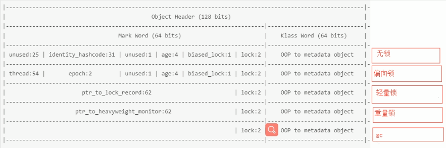

# 杂项速记

## 各种锁

参考博客：https://www.cnblogs.com/jyroy/p/11365935.html

### 乐观锁与悲观锁

这两种锁体现了线程同步的不同角度。  
**悲观锁**：对于同一个临界数据的并发操作，悲观锁认为自己在使用数据的时候一定有别的线程来修改数据，所以在获取数据的时候会先加锁，确保数据不会被别的线程修改。在Java中synchronized关键字和Lock接口的实现类都是悲观锁。  
**乐观锁**：顾名思义，比较乐观，它认为自己在使用数据的时候不会有别的线程来修改数据，所以不会添加锁，只是在更新数据的时候去判断之前有没有别的线程更新了这个数据。如果这个数据没有被更新，当前线程就将自己修改的数据写入临界数据中，如果数据已经被其他线程更新，则根据不同的实现方式执行不同的操作(报错或者自动重试)。乐观锁最常见的实现就是CAS算法，**Java原子类中的递增操作就是通过CAS自旋实现的**

> 所以，可以得到一些有用的点
> 悲观锁适合**写**操作多的场景，先加锁可以保证写操作时数据正确
> 乐观锁适合**读**操作多的场景，不加锁的特点使其读操作性能大幅提升，因为加锁也是有性能消耗的

CAS存在的问题：  

1. ABA问题，JDK1.5开始提供了AtomicStampedReference类来解决ABA问题

2. 循环时间长，开销大，CAS操作如果长时间不成功，会导致其一直自旋，给CPU带来非常大的开销

3. 只能保证一个共享变量的原子操作。对一个共享变量执行操作时，CAS能够保证原子操作，但是对多个共享变量操作时，CAS是无法保证操作的原子性的(JDK1.5之后提供了AtomicReference类来保证引用对象之间的原子性，可以把多个变量放在一个对象里来进行CAS操作)

### 自旋锁与适应性自旋锁

**产生背景**：阻塞和唤醒线程是需要OS切换CPU状态来完成的，这种状态转换有着CPU上下文切换，耗费CPU时间。如果同步代码块中的内容过于简单，状态转换消耗的时间有可能比用户代码执行时间还要长。  

在许多场景中，同步资源的锁定时间很短，为了这一小段时间去切换线程，线程挂起和恢复现场信息的花费可能会让系统得不偿失。如果有多个处理器，能够让两个或以上的线程同时并行执行，我们就可以让后面那个请求锁的线程不放弃CPU的执行时间，看看持有锁的线程是否很快就会释放锁，而为了让当前线程能实现”等待一下“，我们需要让当前线程进行**自旋**，如果在自旋完成后前面锁定同步资源的线程已经释放了锁，那么当前线程就可以不必阻塞而是直接获取临界资源，从而避免切换线程的开销。
  
当然，自旋本身也有他的不足之处的，它无法代替阻塞。自旋虽然避免了线程切换带来的开销，但是，它会持续的占用CPU时间。所以如果所被占用的时间很短，自旋等待的效果就会非常好。反之，如果锁被占用时间很长，那么处在自旋的线程只会白白浪费处理器资源。因此，自旋的等待时间必须要有一定的限度，如果超过了自旋限定次数(默认10次，可以用-XX:PreBlockSpin来更改)，没有成功获得锁，就挂起线程。  
自旋锁的实现原理同样也是CAS，AtomicInteger中调用unsafe进行自增操作的源码中的do-while循环就是一个自旋操作，如果修改数值失败则通过循环来执行自旋，直至修改成功。  
  
自旋锁在JDK1.4.2中引入，使用-XX:+UseSpinning来开启。JDK 6中变为默认开启，并且引入了自适应的自旋锁（适应性自旋锁）。  
**自适应自旋锁**：顾名思义，意味着自旋的时间(次数)不再固定，而是由前一次在同一把锁上的自旋时间以及锁的拥有者的状态来决定。如果在同一个锁对象上，自旋等待刚刚成功获得过锁，并且持有锁的线程正在运行中，那么JVM就会认为此次的自旋是很有可能再次成功的，进而它将允许自旋等待相对较长的时间。如果对于某个锁，自旋很少成功获得过，那在以后尝试获取这个锁的时候可能会省略掉自旋过程，直接阻塞线程，避免浪费处理器资源。  
另外，在自旋锁中 另有三种常见的锁形式:TicketLock、CLHlock和MCSlock

### OTHER

在JDK6之后，为了提高synchronized的效率，引入了**偏向锁**与**轻量级**锁，这时，目前锁一共有4种状态，级别从低到高依次是：无锁、偏向锁、轻量级锁和重量级锁。锁状态只能升级不能降级。

为什么，jvm类晋升到老年代参数只能是小于15的数，因为GC年龄在对象头的mark word中使用了4个bit，所以只能表示0-15.

