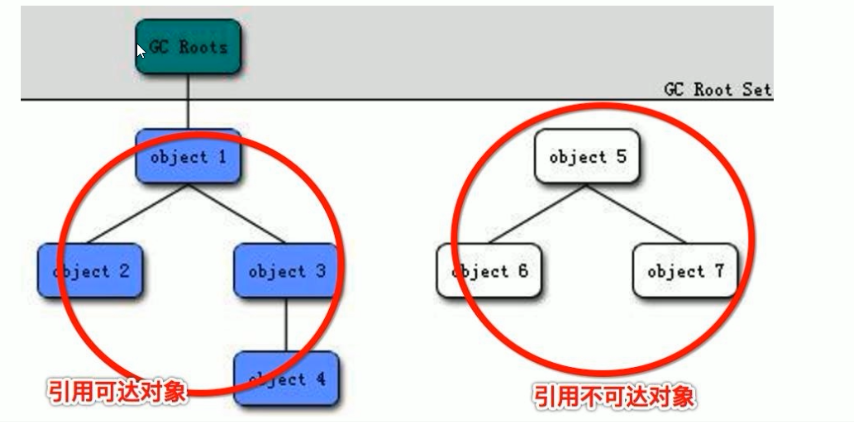

# JVM与GC解析

## Jvm内存结构


## 面试题

### 谈谈你对GC-Roots的理解




**以下对象可以成为GC-Roots对象**

1、虚拟机栈(栈帧中的局部变量表)中的引用的对象  
2、方法区中的类静态属性引用的对象  
3、方法区中常量引用的对象  
4、本地方法栈中JNI(Native方法)引用的对象  

## JVM参数相关
### 三种参数类型
#### 标配参数
在jdk各个版本之间稳定，很少有大的变化，例如：  
`-version, -help` 等

#### X参数

`-Xint`：解释执行  

`-Xcomp`：第一次使用就编译成本地代码  

`-Xmixed`：混合模式  

`-Xms`

`-Xmx`

#### XX参数

> 查看运行汇总的java程序，它的某个Jvm参数是否开启，具体值是多少？
>
> 使用jinfo
> 第一种，使用`jinfo -flag 具体参数 java进程编号`
> 例如 `jinfo -flag PrintGCDetails 13632`
>
> 第二种，使用 java -XX:+PrintFlagsInitial  打印初始值
> ```shell
> C:>java -XX:+PrintFlagsInitial
> [Global flags]
> uintx AdaptiveSizeDecrementScaleFactor          = 4    {product}
> uintx AdaptiveSizeMajorGCDecayTimeScale         = 10   {product}
> uintx AdaptiveSizePausePolicy                   = 0    {product}
> uintx AdaptiveSizePolicyCollectionCostMargin    = 50   {product}
> uintx AdaptiveSizePolicyInitializingSteps       = 20   {product}
> uintx AdaptiveSizePolicyOutputInterval          = 0    {product}
> uintx AdaptiveSizePolicyWeight                  = 10   {product}
> uintx AdaptiveSizeThroughPutPolicy              = 0    {product}
> bool UseLargePagesIndividualAllocation        := false {pd product}
> bool AdjustConcurrency                         = false {product}
> bool AggressiveOpts                            = false {product}
> intx AliasLevel                                = 3     {C2 product}
> bool AlignVector                               = true  {C2 product}
> ....more
> ```
> 可以看见，有些值的等号前面没有冒号，有些值有冒号。在这里，冒号的意思是这个值在JVM加载的时候JVM自己修改或者被人为的修改过
>
> java -XX:PrintFlagsFinal -Xss128k [运行类名]  可以打印运行时的值信息，(首次启动时)
>
> java -XX:PrintCommandLineFlags -version 查看运行时的命令行 (首次启动时)，主要可以用来查看**目前使用的垃圾回收器**
>
> ```shell
> C:\Users\XiongCheng>java -XX:+PrintCommandLineFlags -version
> -XX:InitialHeapSize=267158464 -XX:MaxHeapSize=4274535424 -XX:+PrintCommandLineFlags -XX:+UseCompressedClassPointers -XX:+UseCompressedOops -XX:-UseLargePagesIndividualAllocation -XX:+UseParallelGC
> java version "1.8.0_181"
> Java(TM) SE Runtime Environment (build 1.8.0_181-b13)
> Java HotSpot(TM) 64-Bit Server VM (build 25.181-b13, mixed mode)
> ```
>
> 

1. Boolean类型：  
   -XX:+或者-某个属性值 (+ 表示开始，- 表示关闭)  

2. KV设值类型：  
   -XX:属性key=属性值value  

**踩坑点**
问：-Xms和-Xmx是属于哪种参数类型  
其实：  
-Xms 等价于 -XX:InitialHeapSize  
-Xmx 等价于 -XX:MaxHeapSize  
所以，Xms和Xmx就相当于那两个参数的别名，因此，这两个参数是属于XX参数。  

### 堆内存相关


用代码获取jvm中的内存相关信息

```java
long totalMemory = Runtime.getRuntime().totalMemory();
long maxMemory = Runtime.getRuntime().maxMemory();
```

